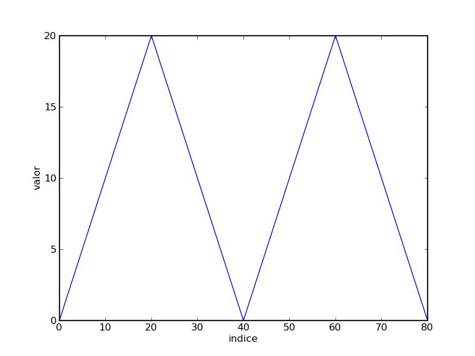

.. raw:: html

  

================================================
Introducción a Octave para la Docencia en la UCA
================================================

Primera sesión
^^^^^^^^^^^^^^

Guillem Borrell i Nogueras

10-13 de Junio de 2008

Temario
=======

* Lenguaje Matlab.

* Sistemas de ecuaciones lineales.

* Polinomios, interpolación y regresión.

* Representación gráfica.

* EDOs.

* Análisis de señales.

* ¿Sugerencias?

Objetivo
========

* Curso de formación de profesorado...

* Tener las mismas sensaciones que el alumno que intenta resolver
  ejercicios con Octave.

* Enseñar a aprender Octave.s

* Las herramientas universales *no existen*

Ayuda.  Función help
====================

En Matlab casi todo es una función.  Cada una de ellas contiene una
pequeña ayuda para que no sea necesario consultar ningún manual.  Para
consultar la ayuda disponemos de la función help::

  >> help eig

El lenguaje Matlab
==================

* Funciones y scripts

* Caracteres especiales

* Tipos

* Variables

* Operadores

* Sentencias

* **Function Handles**

Caracteres especiales
=====================

* Comillas simples para introducir una cadena de texto

* Porcentaje para comentarios

* Tres puntos para continuación de línea

* Punto y coma para un retorno de carro sin salida

Caracteres especiales(II)
=========================

::

  >> % Este comando será ignorado
  >> 'hola' % 'Hola,Matlab!'
  ans = hola

  >> 'hola';
  >> 'hola', 'que tal'
  ans = hola
  ans = que tal

  >> 'hola', ...
  'que tal'
  ans = hola
  ans = que tal

Tipos
=====

* En cualquier lenguaje *dinámico* es muy importante separar los
  conceptos de *tipo* y *variable*.

* Los *tipos* se declaran por asignación.

* La variable es un contenedor que se utiliza para dar nombre a un
  argumento y poder utilizarlo.

* ¿Os suena el *duck typing*?

Tipos numéricos
===============

Matlab tiene un tipo numérico *por omisión*. Cualquier otro tipo
tendrá que asignarse explícitamente

Arrays n-dimensionales de reales de doble precisión
~~~~~~~~~~~~~~~~~~~~~~~~~~~~~~~~~~~~~~~~~~~~~~~~~~~

Secuencias
==========

* Son argumentos dedicados a contar.

* Aparecen siempre que necesitemos un contador en bucles, intervalos.

* Son un atajo para crear vectores fila.

Ejemplo::

  >> 1:5
  1  2  3  4  5
  >> 0:2:10
  0  2  4  6  8  10

Matrices
========

Para diferenciar filas y columnas
~~~~~~~~~~~~~~~~~~~~~~~~~~~~~~~~~

* El espacio o la coma separan elementos de la misma fila

* El retorno de carro o el punto y coma separan filas

.. raw:: latex

  \[ \left( \begin{array}{ccc}
  a & b & c \\
  d & e & f \\
  g & h & i \end{array} \right)\] 
  

.. raw:: html

  `M=[(1,2,3),(4,5,6),(7,8,9)]`

Matrices II
===========

:: 

  >> M=[1,2,3;4,5,6;7,8,9]

Escribir 

.. raw:: html

  `M=[(1,2,3),(4,5,6),(7,8,9)]`

de otros 3 modos posibles

Subíndices
==========

Los arrays indexables del modo usual

:: 

  >> M(1,1)
  ans = 1

  >> M(end,end) %truco del mandruco
  ans = 9

Matlab es bastante tonto 
========================

::

  >> a = pi
  a = 3.1416
  >> a(1)
  ans = 3.1416
  >> a(1,1)
  ans = 3.1416
  >> a(1,1,1)
  ans = 3.1416

* Esto devolvería un error en cualquier otro lenguaje de programación.

* ¿Esto es bueno o es malo?

Por lo menos hay BC
===================

::

  >> a=rand(3,3)
  a =
  
     0.583220   0.285967   0.010804
     0.336715   0.530313   0.860391
     0.060404   0.999098   0.501339
  
  >> a(3,4)
  error: invalid column index = 4

¡Pero no para la asignación!
============================

::

  octave:2> nuevo(4)=1
  nuevo =
  
     0   0   0   1
  
  octave:3> nuevo(4,3)=2
  nuevo =
  
     0   0   0   1
     0   0   0   0
     0   0   0   0
     0   0   2   0
  
Submatrices
===========

Supongamos que de la matriz

.. raw:: html

  `M=[(11,12,13,14,15),(21,22,23,24,25),(31,32,33,34,35),(41,42,43,44,45),(51,52,53,54,55)]`

queremos extraer

.. raw:: html

  `S=[(33,34,35),(43,44,45),(53,54,55)]`

Submatrices
===========

Los subíndices se seleccionan mediante secuencias.  En este caso
queremos |Mij| con *i* de 3 a 5 y *j* de 3 a 5.  El incremento de 1
podemos omitirlo

.. |Mij| raw:: html

  `M_{ij}`

::

  >> S = M(3:5,3:5)
   33   34   35
   43   44   45
   53   54   55

Submatrices
===========

Y para extraer |mat|?

.. |mat| raw:: html

  `T=[(11,13,15),(21,23,25),(31,33,35),(41,43,45),(51,53,55)]`

Submatrices
===========

::

  >> M(:,1:2:5)
  ans =
  
     11   13   15
     21   23   25
     31   33   35
     41   43   45
     51   53   55
  

Otros tipos
===========

:Números complejos: El número imaginario en Matlab es como cualqier
 otro y se expresa con *i*, *I*, *j*, *J*

:Argumentos lógicos: Son *true* y *false*.  0 es falso y cualquier
 otro número es verdaero.

Otros tipos. Cadenas de texto
=============================

* Son matrices de caracteres.

::

  >> s='aupacai'
  s = aupacai
  >> s(4)
  ans = a
  >> s(1:end-2)
  ans = aupac
  >> [s,'campeon'] %concatenar
  ans = aupacaicampeon

Ejercicio
=========

Crear el siguiente vector mediante secuencias. *En Matlab no hay list
comprehensions*.

Ejercicio
=========

Del anterior vector seleccionar los elementos 1, 32, 56 y 67. *Hay que
tener un poco de inventiva*.

Estructuras de datos
====================

Matlab permite agrupar variables en forma de árbol::

  >> ed.num=1.234;
  >> ed.str='hola';
  >> ed.logic.true=1;
  >> ed.logic.false=0;
  >> ed

  ed =

        str: 'hola'
        num: 1.2340
      logic: [1x1 struct]

Cell arrays
===========

Otra manera de agrupar variables es utilizar una estructura parecida a
una matriz.  Para iniciarla utilizaremos llaves en vez de corchetes::

  >> celda={1.234,'hola';true,false}

  celda =

      [1.2340]    'hola'
      [     1]    [   0]

Function handles
================

Los *Function Handles* sirven para asignar una función a una
variable.  Es el recurso más complejo pero a la vez más potente de
Matlab.  Su símbolo es la arroba ( *@* )::

  >> fhsin=@sin

  fhsin =

      @sin

  >> fhsin(pi/2)

  ans =

      1

Ejercicio 2
===========

Un ejercicio inútil pero muy instructivo
~~~~~~~~~~~~~~~~~~~~~~~~~~~~~~~~~~~~~~~~

Construir una estructura de datos que contenga las funciones
trigonométricas *sin*, *cos*, y *tan* y llamarlas en el punto |pi2| a
partir de la misma estructura

.. |pi2| raw:: html

  `\pi / 2`

Operadores
==========

:Operadores matriciales: +,-,*,/,^

:Operadores escalares: .*,./,.^

:Operadores lógicos: &,|,!

:Operadores de comparación: <,>,==,>=,<=,!=

:Operadores de conjuntos: &&,||

Operadores II 
=============

Operadores matriciales y escalares pueden confundirse fácilmente::

  >> a=rand(3,3);
  >> a=rand(3,3);b=rand(3,3);
  >> a*b
  ans =
      1.0297    0.9105    0.3293
      0.9663    0.8267    0.4211
      0.5355    0.4318    0.3279
  >> a.*b
  ans =
      0.1824    0.3253    0.0563
      0.5500    0.6003    0.1897
      0.0458    0.0017    0.1822

Operadores III
==============

O dar resultados extraños::

  >> a=[1,2,3;4,5,6;7,8,9];
  >> a.^pi
  ans =
      1.0000    8.8250   31.5443
     77.8802  156.9925  278.3776
    451.8079  687.2913  995.0416
  >> a^pi
  ans =
   1.0e+03 *
   0.6943 - 0.0004i   0.8540 - 0.0001i   1.0136 + 0.0002i
   1.5743 - 0.0000i   1.9344 - 0.0000i   2.2946 + 0.0000i
   2.4543 + 0.0003i   3.0149 + 0.0001i   3.5756 - 0.0002i

Ejercicio de vectorización
==========================

con |A|, |b| y |c|

.. |A| raw:: html

  `A=((1,2,3),(4,5,6),(7,8,9))`

.. |b| raw:: html

  `b=((1),(2),(3))`

.. |c| raw:: html

  `c=(1,2,3)`

calcular 

* |op1|

.. |op1| raw:: html

  `A \cdot b`

* |op2|

.. |op2| raw:: html

  `\sum_i A_{ij}c_i`

* |op3|

.. |op3| raw:: html

  `b \cdot c`

luego aplicar al resultado de cada operación la función |func|

.. |func| raw:: html

  `x^2 \sin x`

Control de flujo
================

* Las sentencias son palabras clave necesarias para programar

* Con comunes en la mayoría de lenguajes de programación

* Sirven para implementar bucles, condicionales, casos

  * Estas estructuras reciben el nombre de *control de flujo de
    ejecución*

Condicionales
=============

Este es un ejemplo del uso de la sentencia *if*::

  if saludo
    disp('hola')
  else
    disp('no te saludo')
  end

¿Cuál es la salida si saludo=1?

Bucles
======

Ejemplo del uso de la sentencia *for*::

  function primetest(n)
  sprintf('Números primos de 1 a %i\n',n)
  for i=1:n
    if isprime(n)
      disp(i)
    end
  end

¿Cuál es la salida de esta subrutina si n=9?

Otras sentencias
================

:case: Control de casos cerrados

:while: Bucle controlado por condición lógica

:try: Sentencia de control para probar errores

:break: Clave para el control de bucles

:continue: Idem

:return: Devuelve el control al programa principal

Funciones anónimas
==================

Una de las posibilidades de los *Function Handles* es definir
funciones sin necesidad de un archivo adicional. Por ejemplo::

  >> testaf = @(x,y) exp(-(x.^2+y.^2))
  >> testfh(1,i)
  ans = 1

Problemas
=========

* Inconsistencias en el BC

* Inconsistencias en creación llamada, [],()

* Orientación a objetos. *Python*.

* Soporte para más tipos numéricos.

* ¿Vector fila o columna?

Problemas arreglados por Octave
===============================

Inlining

::
 
  octave:1> a=rand(3,3)(1,2)
  a =  0.14272

Permite expresiones mucho más compactas.

Problemas arreglados por Octave
===============================

Declaración de funciones

::

  octave:2> function y=foo(x)
  > y=3*x
  > end
  octave:3> foo(4)
  y =  12
  ans =  12

  
¿A qué espera Mathworks para arreglar esto?

Problemas arreglados por Octave
===============================

El precio

  
Conclusiones
============

* El lenguaje Matlab es muy limitado

* Es sencillo y su sintaxis es clara

* Sus estructuras son muy matemáticas

* Está basado en funciones y aún no conocemos ninguna

* Sin una biblioteca de funciones Matlab no es ni siquiera un buen
  lenguaje de programación

Álgebra
=======

Con estas funciones se puede crear casi cualquier matriz

:eye: Matriz de ceros con unos en la diagonal

:linspace: Vector de elementos equiespaciados

:logspace: Vector de elementos espaciados exponencialmente

:meshgrid: Matrices equiespaciadas de dos dimensiones

:ones: Matriz de unos

:zeros: Matriz de ceros

:rand: Matriz de números pseudoaleatorios.

Manipulación de matrices
========================

:reshape: Cambia la forma de la matriz conservando el número de
 elementos

:transpose: Traspuesta. Equivale a .'

:ctranspose: Matriz conjugada. Equivale a '

:rot90: Gira la matriz 90 grados en sentido antihorario.

Ejercicio 4
===========

Generar la matriz

.. raw:: html

  `L=((-2,1,0,0,0,0,1),(1,-2,1,0,0,0,0),(0,1,-2,1,0,0,0),(0,0,1,-2,1,0,0),(0,0,0,1,-2,1,0),(0,0,0,0,1,-2,1),(1,0,0,0,0,1,-2))`

Usando también la función *diag*

Resolución de SEL
=================

Para resolver sistemas de eucuaciones lineales contamos con un
operador universal::

  >> A=[1,0;2,1];y=[2;4];
  >> x=A\y
  x =

    2
    0

¿En qué se diferencia de la división?

