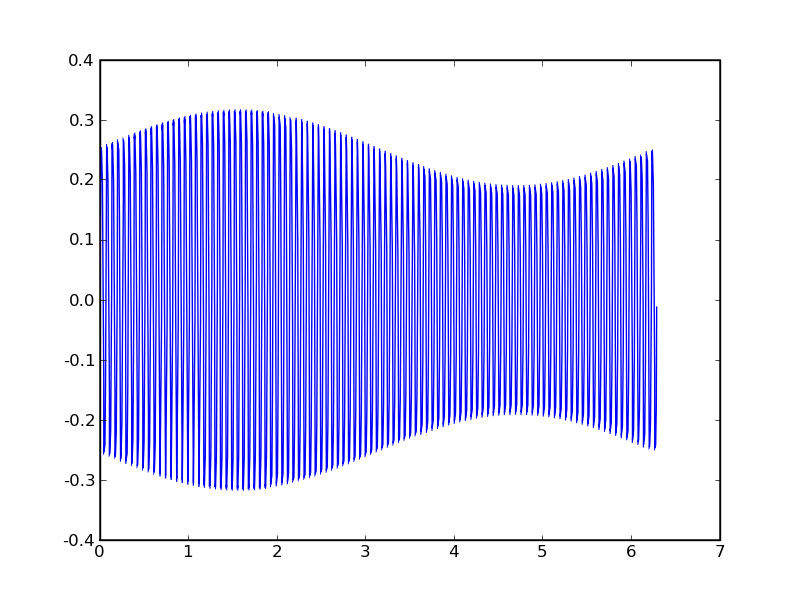

.. raw:: html

  

================================================
Introducción a Octave para la Docencia en la UCA
================================================

Tercera sesión
^^^^^^^^^^^^^^

Guillem Borrell i Nogueras

10-13 de Junio de 2008

Temario
=======

* Lenguaje Matlab.

* Sistemas de ecuaciones lineales.

* Integración numérica.

* Polinomios, interpolación y regresión.

* Representación gráfica.

* EDOs.

* Resolución de sistemas de ecuaciones no lineales.

* Análisis de señales.

Ayuda
=====

La ayuda de la función es cualquier comentario antes de la primera
sentencia ejecutable.

::

  function y=foo(x)
  
  % funcion foo
  % no hace absolutamente nada
  
  y=z

Entrada y salida
================

* Los programas, en este caso los scripts, deben tener la posibilidad
  de cargar datos o guardar sus resultados.

* Cambio de filosofía.

  * Más interactividad. *funciones* e *intérprete*

  * No proporcionar programas monolíticos.

Entrada y salida
================

* diary

* disp, input

* printf, scanf

* load, save

* print

* dispositivos

diary
=====

* *diary on* activa el registro de comandos

* *diary off* desactiva el registro de comandos

* Por omisión todo se guarda en un documento llamado *diary*

disp, input
===========

::

  octave:1> a=[1,2,3];
  octave:2> disp(a)
     1   2   3
  octave:3> a=input('un numero, por favor')
  un numero, por favor4
  a =  4

printf, scanf
=============

* E/S al estilo de C

:: 

  >> printf('hola %i, %f, %s\n',3,3.234,'hola')
  hola 3, 3.234000, hola

  
load, save
==========

* Operaciones para guardar o cargar datos en archivos.

* Soporta varios formatos binarios de compresión.

* Podemos forzar que la escritura sea en ascii.

::

  >> a=[1,2,3,2,1]
  a =
  
     1   2   3   2   1
  
  >> save -v7 'a.dat' a
  
print
=====

* Sirve para obtener una captura de la figura activa.

* Soporta casi todos los formatos que podamos necesitar (depende del
  backend).

::

  >> print -deps 'figura.eps'
  >> print -djpg 'figura.jpg'  

Lectura y escritura en dispositivos
===================================

* loadimage, saveimage

* record(UNIX), playaudio(UNIX)

* loadaudio, saveaudio

Resolución de sistemas de ecuaciones no lineales
================================================

* *fsolve*

Resolver |eq|

.. |eq| raw:: html

  `tan(x) - (x+\frac{x^3}{2})=0`

::

  octave:19> F=@(x) tan(x) - (x+x.^3/2);
  octave:20> fsolve(F,0)
  ans = 0
  octave:21> fsolve(F,1)
  ans =  0.91100

Ejercicio
=========

Resolver este sistema de ecuaciones con *fsolve*

.. raw:: html

  `((2x_1 - x_2 = e^{-x_1}),(-x_1 + 2x_2=e^{-x_2}))`
    
Análisis de señales
===================

* FFT, uno de los algoritmos más utilizados en cálculo numérico.

* Algoritmo |order|. Casi *O(n)* para *n* grandes.

* Dos colecciones de funciones: transformadas y filtros

* En Octave-forge: *signal*.

.. |order| raw:: html

  `O(n log(n))`

Ejercicio: señal modulada en amplitud
=====================================

1. Generar la señal y la portadora.

  1. La señal es |senal|

  2. La portadora es |portadora|

2. Sumar la señal y la portadora.

3. Rectificar la señal.

.. |senal| raw:: html

  `sin(x)/5, x \in [0,2\pi] (1Hz)`

.. |portadora| raw:: html

  `sin(100x), x \in [0,2\pi] (100Hz)`

Ejercicio: señal modulada en amplitud
=====================================

1. Eliminar el nivel de continua. *detrend*

2. Eliminar la componente de la señal, inferior a 50Hz. (filtro
   pasa-altos).

3. Eliminar los armónicos superiores a 150 Hz. (filtro
   pasa-bajos).

4. Representar la señal obtenida.

Resultado
=========

Control lineal
==============

* Octave cuenta con las funciones básicas para el análisis de bloques
  en plantas.

* También es capaz de simular sistemas discretos *T_SAM*.

::

  >> controldemo

Ejercicio
=========

Dado un sistema lineal cuya función de transferencia es: |tf|

.. |tf| raw:: html

  `\frac{s+1}{s^2+2s+1}`

* Crear el sistema mediante la función *tf*

* Obtener la respuesta en frecuencia y fase con *bode*

* Obtener el diagrama de *nyquist*.

* Obtener las respuestas a impulso y a escalón con *impulse* y *step*.

* Obtener el lugar de las raíces con la función *rlocus*

Gracias
=======

* ¿Qué tal lo he hecho?

* http://iimyo.forja.rediris.es/
