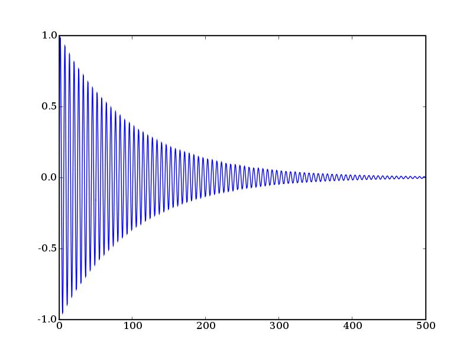

.. raw:: html

  

===================================================
Octave: una alternativa real a Matlab a coste cero.
===================================================

Guillem Borrell Nogueras
~~~~~~~~~~~~~~~~~~~~~~~~

Índice
======

* Introducción, Matlab y Octave

* Ventajas de Octave sobre Matlab

* Ejemplos

* Material
  
  * http://torroja.dmt.upm.es:9673/Guillem_Site/CursoMatlab/

  * Curso de Matlab

  * *Introducción informal a Matlab y Octave*

Antes de empezar
================

.. admonition:: Pregunta...

  ¿Alguno de los presentes no sabe qué es Matlab?

Que hable ahora o calle para siempre.

Matlab
======

Matlab es un lenguaje de programación...

* *Interpretado*.

* *interactivo*.

* Orientado a cálculo numérico.

* Dispone de una de las bibliotecas para cálculo e ingeniería más
  importantes.

* Extensible mediante C y Fortran (principalmente)

* Enormemente útil

Ejemplos
========

::

  >> 2+2
  ans = 4

.. raw:: html

  `\int_0^4.5 J_{2.5}dx`

:: 

  >> quad(@(x) besselj(2.5,x)0,4.5)
  ans = 1.1178

Representación gráfica::

  >> x=linspace(0,500,100000);
  >> plot(x,exp(-x/100).*sin(x))

Representación gráfica
======================

El lenguaje Matlab no es
========================

* Orientado a objetos (*)

* Modular

* Completamente interactivo

* Consistente

* Estable

Opinión personal: como lenguaje de programación deja bastante que
desear.

Otros lenguajes parecidos
=========================

* Mathematica

* Scilab

* IDL

* R,S

* **Octave**

Y una estrella emergente:

Python
------

Octave
======

* http://www.octave.org

* http://wiki.octave.org

* Listas de correo

  * help-octave@octave.org

  * bug-octave@octave.org

  * octave-sources@octave.org
 
  * ...

Un poco de historia
===================

* Matlab

  * Producto de MathWorks

  * Diseñado por Cleve Moler a finales de los 70

  * Fecha de nacimiento oficial: 1984

* Octave

  * Nació para evitar a los estudiantes programar en Fortran.

  * Primera versión alpha: primavera del 1992

  * 1.0: Febrero 1994

  * El desarrollador principal es John W. Eaton

Octave
======

.. admonition:: Aclaración

  Octave no nació como un remplazo de Matlab sino que ha ido
  convergiendo.

John W. Eaton::

  Hay diferencias entre Matlab y Octave y algunas
  seguirán así.  No existen porque Octave esté 
  roto sino porque creemos que Matlab lo está.

¿Una alternativa?
=================

* Octave es compatible con Matlab al 99%

* 99% no es un 100%

* Octave es peor en algunos aspectos

* Octave es mejor en otros

¿Cuál es la ventaja esencial?
-----------------------------

Octave es...
============

Software libre
--------------

* Parte del proyecto GNU

* Bajo la licencia GPL v.2

* Release cada 3 meses aprox.

* Escrito en C++

* Versiones para Linux, Windows, MacOS X...

* Al igual que Matlab utiliza librerías que también son SL

  * Atlas

  * SparseSuite

  * FFTW

¿Por qué sustituir Matlab?
==========================

* Matlab es un producto comercial.

* **No es estable**.

* Sistema de licencias complicado.

* Caro, muy caro.

.. admonition:: Una opinión **muy** personal

  Creo que Matlab no vale lo que cuesta

Casos
=====

* CERN

* Rolls-Royce

* Universidades

  * ¿Un estudiante **realmente necesita Matlab**?

  * El coste de una licencia de Matlab es aproximadamente el de dos
    ordenadores.

.. admonition:: Mentira

  Hay que enseñar Matlab porque es lo que se utiliza en la industria.

Posibles razones para comprar Matlab
====================================

* GUI

* Plotting

* Algunos toolkits

* Matlab compiler

* Creación de GUI

* Optimización automática (JIT)

Razones para odiar Matlab y amar Octave
=======================================

* GUI

* Parser

* Enlazado desde C++

* Precio

* Inestabilidad.  Matlab se cae de vez en cuando

Octave es bueno en:
===================

* Extensible, muy extensible

* ``--link-stand-alone`` (Octave embedded)

* Buena biblioteca para programar en C++

* Un buen programador puede hacer maravillas sólo si ve el código

* El parser es netamente superior

* Soporte para matrices sparse

¿Por qué seguir usando Matlab?
==============================

¿Es Matlab una herramienta universal?
-------------------------------------

* Si no utilizamos Matlab hasta para hacer tortillas de patatas

* Si no necesitamos un determinado toolkit y no podemos programarlo
  nosotros mismos.

* Si no nos lo regalan.

* Si no nos obligan a usarlo.

Entonces no hay ninguna razón real para no usar Octave.

Dejemos en paz Matlab
=====================

Y vamos a comprobar qué es capaz de hacer Octave.  Lo siento para el
que no tenga experiencia en CN.

1. Octave

2. Tests

3. Extender Octave

4. Embedded

Flujo alrededor de un cilindro
==============================

Sabiendo un poco de aerodinámica y variable compleja. El potencial
complejo de velocidades alrededor de un cilindro de radio unidad es: 

.. raw:: html

  `f(t)= t+ 1/t +(i \Gamma)/(2 \pi)\log t`

Representar las líneas de corriente.

Flujo alrededor de un cilindro
==============================

La solución es tan sencilla como::

  gamma=input('¿Circulación?');

  f=@(x,y) (x+i*y) + 1./(x+i*y) + (i*gamma)/(2*pi)*log(x+i*y);
  [XX,YY]=meshgrid(linspace(-5,5,100),linspace(-5,5,100));

  contour (XX,YY,-imag(f(XX,YY)),29)

Solución
========

Para |Gamma| = 10

.. |Gamma| raw:: html

  `\Gamma`

.. figure:: files/cilindro.jpg

Consideraciones
===============
* Para los que no conozcan Matlab

  * Se ha llegado a un resultado no tivial
 
  * El esfuerzo ha sido mínimo

  * Notar la gran cantidad de funciones utilizadas

* Para los que conocen Matlab

  * Uso de una función anónima

  * Este código ejecuta con un resultado idéntico tanto en Matlab como
    en Octave

  * Evidentemente si nos esforzamos lo suficiente encontraremos algo
    que no será compatible.

Aumentar la velocidad
=====================

Vamos a integrar el atractor de Lorentz

.. raw:: html

  `((\dot x=a(y-x)),(\dot y = x(b-z)-y),(\dot z=xy-cz))`

La función que implementa la ecuación es::

  function xdot=lorentz(t,x)
    a=10;b=28;c=8/3;
    xdot(1,1)=a*(x(2)-x(1));
    xdot(2,1)=x(1)*(b-x(3))-x(2);
    xdot(3,1)=x(1)*x(2)-c*x(3);
  end

Ampliar octave con C++
======================

Escribir una función en C++ es tan fácil como::

  #include <octave/oct.h>
  DEFUN_DLD (eqlorentz,args, ,
      "Ecuacion de Lorentz en C++")
      {
      ColumnVector xdot (3);
      ColumnVector x (args(0).vector_value());
      int a=10;
      int b=28;
      double c=8./3;
      xdot(0) = a*(x(1)-x(0));
      xdot(1) = x(0)*(b-x(2))-x(1);
      xdot(2) = x(0)*x(1)-c*x(2);

      return octave_value (xdot);
      }

Ampliar octave con C++
======================

Luego se compila con ``mkoctfile``::

  $> mkoctfile eqlorentz.cpp

Esto genera un archivo de nombre ``eqlorentz.oct``, que es una función
que puede incrustarse en el intérprete

La diferencia de velocidad de ejecución de las funciones escritas en
C++ es un orden de magnitud mayor.

Aumentar la velocidad
=====================

Integramos con::

  x0=[1;1;1];
  t=linspace(0,50,5000);
  tic;x=lsode(@lorentz,x0,t);toc

El tiempo de cálculo (Athlon 2000 XP) es de **5.1 s**. Si lo integramos
con::

  x0=[1;1;1];
  t=linspace(0,50,5000);
  tic;x=lsode(@eqlorentz,x0,t);toc

El tiempo se reduce a **0.36 s**

Solución
========

Si pintamos la solución con octaviz

.. figure:: files/lorentz.jpg

Conclusiones
============

* Con nociones básicas de C++ podemos conseguir velocidades de
  ejecución características de lenguajes compilados

* Podemos utilizar también C y Fortran

* Construir wrappers es relativamente sencillo

* Pueden llamarse funciones escritas en Octave desde C++ (callbacks)

* Dota a Octave de una potencia casi ilimitada

* Soporta también archivos MEX

Tests
=====

¿Por qué son importantes los test?

Adelante, estrujaos un poco la sesera
-------------------------------------

Los test (unit test, doctest) son parte fundamental de la programación
moderna. (XP)

Matlab no tiene ninguna sintaxis definida para test, Octave sí.

Ejemplo
=======
::

  function b = matpow(a, n)
    b = eye(size(a));
    for i = 1:n
      b = b * a;
    endfor
  endfunction

Esta función devuelve la potencia entera de una matriz cuadrada.  Al
final del archivo que continene la función ponemos los test

Ejemplo (cont)
==============

::

  %!shared a
  %!test
  %!  a = [ 2.0, -3.0;
  %!       -1.0,  1.0];
  %!
  %!assert(matpow(a,0), diag([1,1]));
  %!assert(matpow(a,1), a);
  %!assert(matpow(a,2), a^2);
  %!assert(matpow(a,3), a^3);
  %!assert(matpow(a,4), a^4);
  %!assert(matpow(a,22), a^22);
  %!assert(matpow(a,23), a^23);

Ejemplo (cont)
==============

Y finalmente utilizamos los test::

  octave:1> test matpow
  PASSES 8 out of 8 tests

Para escribir los test sólo necesitamos conocer el funcionamiento de
``assert``, ``fail`` y ``error``.

.. warning::

  Escribir testsuites para cada funcion es **muy** recomendable

Octave embebido en C++
======================

Un pequeño programa en C++::

  #include <iostream>
  #include <oct.h>

  int main(void)
  {
    Matrix a = Matrix (2,2);
    ColumnVector b = ColumnVector(2);
    a(0,0)=2.;a(1,0)=5.;
    a(0,1)=-6.;a(1,1)=3.;
    b(0)=1.;b(1)=0.;

    std::cout  << a.solve(b);
    return 0;
  }

Embedded(cont)
==============

Lo compilamos::

  $> mkoctfile --link-stand-alone embedded.cpp

Y lo ejecutamos::

  $> ./a.out
  0.0833333
  -0.138889

¿Qué hemos hecho?

Embedded (cont)
===============

Acabamos de resolver el sistema de ecuaciones

.. raw:: html

  `((2,-6),(5,3))\ x = ((1),(0))`

Es un programa en C++ pero podemos conectarlo con el intérprete de
octave y aprovechar incluso funciones escritas en Matlab.

Algunas recomendaciones
=======================

Octave en sí está un poco huérfano.  Necesita de aplicaciones externas
para ser completamente funcional

*  Gráficos 2D
  
  * Gnuplot (Feo)

  * Octplot (Demasiado verde)

* Gráficos 3D

  * Octaviz (Una maravilla, wrappers de VTK)

* Editores

  * Emacs (Linux)

  * Scite (Windows)

* GUI

  * Qtoctave (fresquito, fresquito y made in Spain)

Para terminar
=============

* Transparencias hechas en *restructuredtext*

* Mi email: guillemborrell@gmail.com

* *Introducción informal a Matlab y Octave* está en busca de autor.
   Yo abandono.

Muchas Gracias
==============
