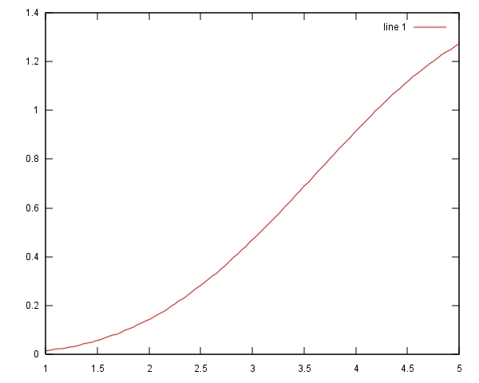
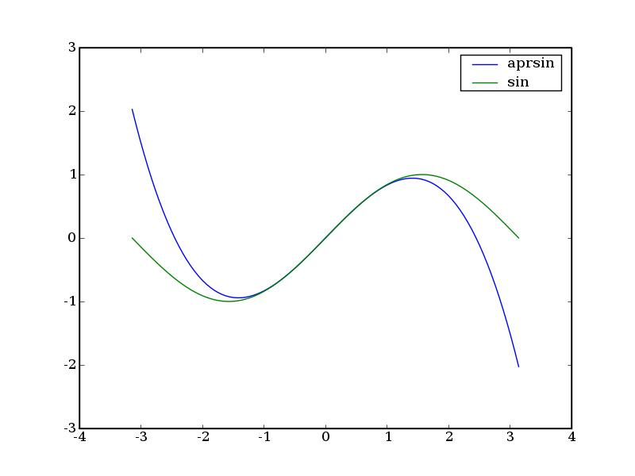

.. raw:: html

  

=======================================
Introducción informal a Matlab y Octave
=======================================

Primera sesión
^^^^^^^^^^^^^^

Guillem Borrell i Nogueras

Curso 2006-2007

¿Qué es Matlab?
===============

* Es un programa para resolver problemas numéricos

* Un lenguaje de programación

* Un lenguaje *interpretado*

* Un lenguaje *interactivo*

Usar Matlab = Programar en Matlab.
~~~~~~~~~~~~~~~~~~~~~~~~~~~~~~~~~~

¿Qué no es Matlab?
==================

* Un lenguaje *compilado*

* Un programa de cálculo simbólico

  Matlab puede hacer |int1| pero no |int2|

.. |int1| raw:: html

  `int_0^1 erf(x)dx=0.486`

.. |int2| raw:: html

  `int erf(x)dx=x\ erf(x)+e^(-x^2)/\sqrt(\pi)`

* Una hoja de cálculo

* Una herramienta gráfica

* Un resolvedor de problemas

¿Qué es eso de interpretado?
============================

* Concepto importante en el mundo de la programación.

* No hay compilador, hay un intérprete.

* Lenguajes compilados: C, Fortran, Pascal

* Lenguajes interpretados: Java, Python, Ruby

**¿Es la primera vez que te hablan de esto?**

Encended Matlab y fijaros en el símbolo::

  >>

Es una *consola* o *SHELL*

Algunas mentiras
================

* Para ser ingeniero aeronático no es necesario saber programar

* Programar es difícil

* Programar **bien** es fácil

* Los ingenieros programan bien

* En la vida basta con un lenguaje de programación mientras se domine

Algunas omisiones
=================

C++, C#, Java, XML, Matlab, Scripting, GCC, UNIX, Python, Perl, Ruby,
.NET, mono, Octave, Maple, Maxima, Eclipse, Emacs, VIM, CVS, Subversion,
Linux, git, UML, Objeto, Clase, herencia...

¿Cuántos nombres os suenan?
~~~~~~~~~~~~~~~~~~~~~~~~~~~

Un autoengaño
=============

**Pero si no me enseñan ninguna de estas herramientas en la escuela
será porque no las necesito...**

Salgamos de la ignorancia
=========================

Supongamos que tengo que resolver este problema:

Representar |bessel| con |dominio|

.. |bessel| raw:: html

  `\int_0^y J_2.5(x) dx`

.. |dominio| raw:: html

  `y \in [1,5]`

¿Cuál sería el coste de resolverlo en Fortran o en C?

¿Cuál sería el coste de resolverlo con excel?

¿Y si os digo que resolverlo en Matlab son **6** líneas?

El resultado(1)
===============

6 líneas::

  >> x=linspace(1,5,100);
  >> intbessel=@(y) quad(@(x) besselj(2.5,x),0,y);
  >> for i=1:100
       z(i)=intbessel(x(i));
       end
  >> plot(x,z);

No os preocupeis si de momento no entendeis nada.  Se requieren
varios años de experiencia para programar así

El resultado(2)
===============

Esta bonita curva

No es tan difícil
=================

Matlab puede utilizarse también como una calculadora::

  >> 2+2

  ans = 4

  >> mean([1,2,3,4,5,6,7,8,9])

  ans = 5

  >> abs(3+4i)

  ans = 5

Octave
======

* Es una implementación libre y gratuita del lenguaje Matlab

* http://www.octave.org

* Es un programa muy utilizado en GNU/Linux

* Existe una versión para Windows

* No tiene interfaz gráfica (*No la necesitamos*)

¿Por qué Octave?
================

* Octave implementa el 99% del lenguaje Matlab

* Es libre y gratuito

* Matlab es muy caro. *¿Cuánto?*

* Porque os lo digo yo

El lenguaje Matlab
==================

* Caracteres especiales

* Funciones y scripts

* Argumentos

* Variables

* Operadores

* Sentencias

* **Function Handles**

Caracteres especiales
=====================

* Comillas simples para introducir una cadena de texto

* Porcentaje para comentarios

* Tres puntos para continuación de línea

* Punto y coma para un retorno de carro sin salida

Caracteres especiales(II)
=========================

::

  >> % Este comando será ignorado
  >> 'hola' % 'Hola,Matlab!'
  ans = hola

  >> 'hola';
  >> 'hola', 'que tal'
  ans = hola
  ans = que tal

  >> 'hola', ...
  'que tal'
  ans = hola
  ans = que tal

El directorio de trabajo
========================

* Matlab puede ejecutar archivos de código.

* Matlab puede cargar archivos de datos.

* La biblioteca de funciones son archivos de código.

¿Cómo sabe Matlab dónde buscar? Matlab busca en sus directorios de
sistema más el **directorio de trabajo**

.. warning::

  Todo el que se queje que Matlab no encuentra algo y no tenga bien la
  variable del directorio de trabajo será públicamente ridiculizado.

Funciones y scripts
===================

* Dos tipos de archivos que contienen código.

* Terminados con la extensión .m

* Las funciones sirven para encapsular tareas

  * Tienen argumentos de entrada y salida

* Los scripts son programas, procesos autónomos

  * No tienen variables de entrada o salida

  * Pueden y deben hacer uso de funciones.

Funciones. Sintaxis
===================

::

  function [sal1,sal2,...] = nombre(ent1,ent2,...)
    sentencias ejecutables
    sal1= ...
    sal2= ...

Lo guardaremos todo en un archivo de nombre::

  nombre.m

**en el directorio de trabajo**

Nuestra primera función
=======================

Abriremos el *editor* y en él escribiremos::

  function y = aprsin(x)
    y=x-(x.^3)/6

Lo guardaremos con nombre *aprsin.m* y lo guardaremos en el directorio
de trabajo.

Luego en la consola Matlab podremos probarla::

  >> aprsin(1.3)

Nuestro primer script
=====================

En el editor crearemos un archivo que contenga::

  x=linspace(-pi,pi,100);
  for i = 1:100
    y(i)=aprsin(x(i));
  end
  plot(x,[y;sin(x)])
  legend(’aprsin’,’sin’)

Lo guardaremos en un archivo llamado *comparar.m*

Para ejecutar el script iremos al intérprete y introduciremos su
nombre::

  >> comparar

Resultado
=========

Ayuda.  Función help
====================

En Matlab casi todo es una función.  Cada una de ellas contiene una
pequeña ayuda para que no sea necesario consultar ningún manual.  Para
consultar la ayuda disponemos de la función help::

  >> help eig

Argumentos
==========

En cualquier lenguaje de programación es muy importante separar los
conceptos de argumento y variable.

:Argumento: Es cualquier elemento manipulable. En Matlab son los
 escalares, matrices funciones...

:Variable: es un contenedor que se utiliza para dar nombre a un
 argumento y poder utilizarlo.

Tipos numéricos
===============

En Matlab sólo hay un tipo numérico

Arrays n-dimensionales de reales de doble precisión
~~~~~~~~~~~~~~~~~~~~~~~~~~~~~~~~~~~~~~~~~~~~~~~~~~~

::

  >> a = pi
  a = 3.1416
  >> a(1)
  ans = 3.1416
  >> a(1,1)
  ans = 3.1416
  >> a(1,1,1)
  ans = 3.1416

Matrices
========

Para diferenciar filas y columnas
~~~~~~~~~~~~~~~~~~~~~~~~~~~~~~~~~

* El espacio o la coma separan elementos de la misma fila

* El retorno de carro o el punto y coma separan filas

.. raw:: html

  `M=[(1,2,3),(4,5,6),(7,8,9)]`

Matrices II
===========

:: 

  M=[1,2,3;4,5,6;7,8,9]

Escribir 

.. raw:: html

  `M=[(1,2,3),(4,5,6),(7,8,9)]`

de otros 3 modos posibles

Secuencias
==========

Son argumentos dedicados a contar.  Aparecen siempre que necesitemos
un contador en bucles, intervalos.  Su sintaxis es::

  inicio:salto:final

Ejemplo::

  >> secuencia= 0:2:10
  0  2  4  6  8  10

Submatrices
===========

Supongamos que de la matriz

.. raw:: html

  `M=[(11,12,13,14,15),(21,22,23,24,25),(31,32,33,34,35),(41,42,43,44,45),(51,52,53,54,55)]`

queremos extraer

.. raw:: html

  `S=[(33,34,35),(43,44,45),(53,54,55)]`

Submatrices II
==============

Para seleccionar los elementos de las filas y columnas usaremos
secuencias.  En este caso queremos |Mij| con *i* de 3 a 5 y *j* de 3 a
5.  El incremento de 1 podemos omitirlo

.. |Mij| raw:: html

  `M_{ij}`

::

  >> S = M(3:5,3:5)

Y para extraer |mat|?

.. |mat| raw:: html

  `T=[(11,13,15),(21,23,25),(31,33,35),(41,43,45),(51,53,55)]`

Otros tipos
===========

:Números complejos: El número imaginario en Matlab es como cualqier
 otro y se expresa con *i*, *I*, *j*, *J*

:Cadenas de texto: Se introducen entre comillas.  Cualquier otro texto
 se tomará como el nombre de una variable

:Argumentos lógicos: Son *true* y *false*.  0 es falso y cualquier
 otro número es verdaero.

Estructuras de datos
====================

Matlab permite agrupar variables en forma de árbol::

  >> ed.num=1.234;
  >> ed.str='hola';
  >> ed.logic.true=1;
  >> ed.logic.false=0;
  >> ed

  ed =

        str: 'hola'
        num: 1.2340
      logic: [1x1 struct]

Cell arrays
===========

Otra manera de agrupar variables es utilizar una estructura parecida a
una matriz.  Para iniciarla utilizaremos llaves en vez de corchetes::

  >> celda={1.234,'hola';true,false}

  celda =

      [1.2340]    'hola'
      [     1]    [   0]

Function handles
================

Los *Function Handles* sirven para asignar una función a una
variable.  Es el recurso más complejo pero a la vez más potente de
Matlab.  Su símbolo es la arroba ( *@* )::

  >> fhsin=@sin

  fhsin =

      @sin

  >> fhsin(pi/2)

  ans =

      1

Ejercicio 2
===========

Un ejercicio inútil pero muy instructivo
~~~~~~~~~~~~~~~~~~~~~~~~~~~~~~~~~~~~~~~~

Construir una estructura de datos que contenga las funciones
trigonométricas *sin*, *cos*, y *tan* y llamarlas en el punto |pi2| a
partir de la misma estructura

.. |pi2| raw:: html

  `\pi / 2`

Operadores
==========

:Operadores matriciales: +,-,*,/,^

:Operadores escalares: .*,./,.^

:Operadores lógicos: &,|,!

:Operadores de comparación: <,>,==,>=,<=,!=

:Operadores de conjuntos: &&,||

Operadores II 
=============

Operadores matriciales y escalares pueden confundirse fácilmente::

  >> a=rand(3,3);
  >> a=rand(3,3);b=rand(3,3);
  >> a*b
  ans =
      1.0297    0.9105    0.3293
      0.9663    0.8267    0.4211
      0.5355    0.4318    0.3279
  >> a.*b
  ans =
      0.1824    0.3253    0.0563
      0.5500    0.6003    0.1897
      0.0458    0.0017    0.1822

Operadores III
==============

O dar resultados extraños::

  >> a=[1,2,3;4,5,6;7,8,9];
  >> a.^pi
  ans =
      1.0000    8.8250   31.5443
     77.8802  156.9925  278.3776
    451.8079  687.2913  995.0416
  >> a^pi
  ans =
   1.0e+03 *
   0.6943 - 0.0004i   0.8540 - 0.0001i   1.0136 + 0.0002i
   1.5743 - 0.0000i   1.9344 - 0.0000i   2.2946 + 0.0000i
   2.4543 + 0.0003i   3.0149 + 0.0001i   3.5756 - 0.0002i

Ejercicio 3
===========

con |A|, |b| y |c|

.. |A| raw:: html

  `A=((1,2,3),(4,5,6),(7,8,9))`

.. |b| raw:: html

  `b=((1),(2),(3))`

.. |c| raw:: html

  `c=(1,2,3)`

calcular 

* |op1|

.. |op1| raw:: html

  `A \cdot b`

* |op2|

.. |op2| raw:: html

  `\sum_i A_{ij}c_i`

* |op3|

.. |op3| raw:: html

  `b \cdot c`

luego aplicar al resultado de cada operación la función |func|

.. |func| raw:: html

  `x^2 \sin x`

Control de flujo
================

* Las sentencias son palabras clave necesarias para programar

* Con comunes en la mayoría de lenguajes de programación

* Sirven para implementar bucles, condicionales, casos

  * Estas estructuras reciben el nombre de *control de flujo de
    ejecución*

Condicionales
=============

Este es un ejemplo del uso de la sentencia *if*::

  if saludo
    disp('hola')
  else
    disp('no te saludo')
  end

¿Cuál es la salida si saludo=1?

Bucles
======

Ejemplo del uso de la sentencia *for*::

  function primetest(n)
  sprintf('Números primos de 1 a %i\n',n)
  for i=1:n
    if isprime(n)
      disp(i)
    end
  end

¿Cuál es la salida de esta subrutina si n=9?

Otras sentencias
================

:case: Control de casos cerrados

:while: Bucle controlado por condición lógica

:try: Sentencia de control para probar errores

:break: Clave para el control de bucles

:continue: Idem

:return: Devuelve el control al programa principal

Funciones anónimas
==================

Una de las posibilidades de los *Function Handles* es definir
funciones sin necesidad de un archivo adicional. Por ejemplo::

  >> testaf = @(x,y) exp(-(x.^2+y.^2))
  >> testfh(1,i)
  ans = 1

Conclusiones
============

* El lenguaje Matlab es muy limitado

* Es sencillo y su sintaxis es clara

* Sus estructuras son muy matemáticas

* Está basado en funciones y aún no conocemos ninguna

* Sin una biblioteca de funciones Matlab no es ni siquiera un buen
  lenguaje de programación

Álgebra
=======

Con estas funciones se puede crear casi cualquier matriz

:eye: Matriz de ceros con unos en la diagonal

:linspace: Vector de elementos equiespaciados

:logspace: Vector de elementos espaciados exponencialmente

:meshgrid: Matrices equiespaciadas de dos dimensiones

:ones: Matriz de unos

:zeros: Matriz de ceros

:rand: Matriz de números pseudoaleatorios.

Manipulación de matrices
========================

:reshape: Cambia la forma de la matriz conservando el número de
 elementos

:transpose: Traspuesta. Equivale a .'

:ctranspose: Matriz conjugada. Equivale a '

:rot90: Gira la matriz 90 grados en sentido antihorario.

Ejercicio 4
===========

Generar la matriz

.. raw:: html

  `L=((-2,1,0,0,0,0,1),(1,-2,1,0,0,0,0),(0,1,-2,1,0,0,0),(0,0,1,-2,1,0,0),(0,0,0,1,-2,1,0),(0,0,0,0,1,-2,1),(1,0,0,0,0,1,-2))`

Usando también la función *diag*

Resolución de SEL
=================

Para resolver sistemas de eucuaciones lineales contamos con un
operador universal::

  >> A=[1,0;2,1];y=[2;4];
  >> x=A\y
  x =

    2
    0

¿En qué se diferencia de la división?

