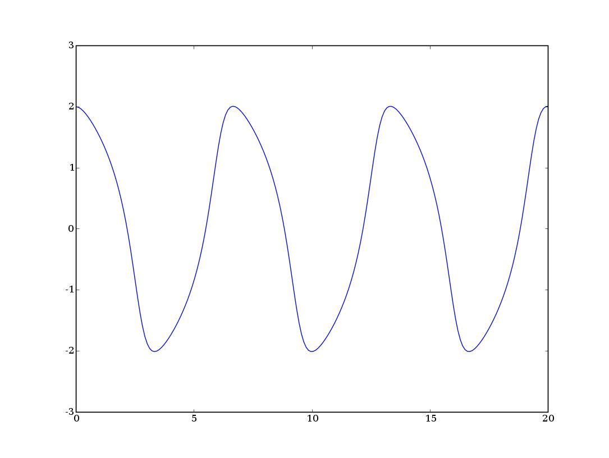
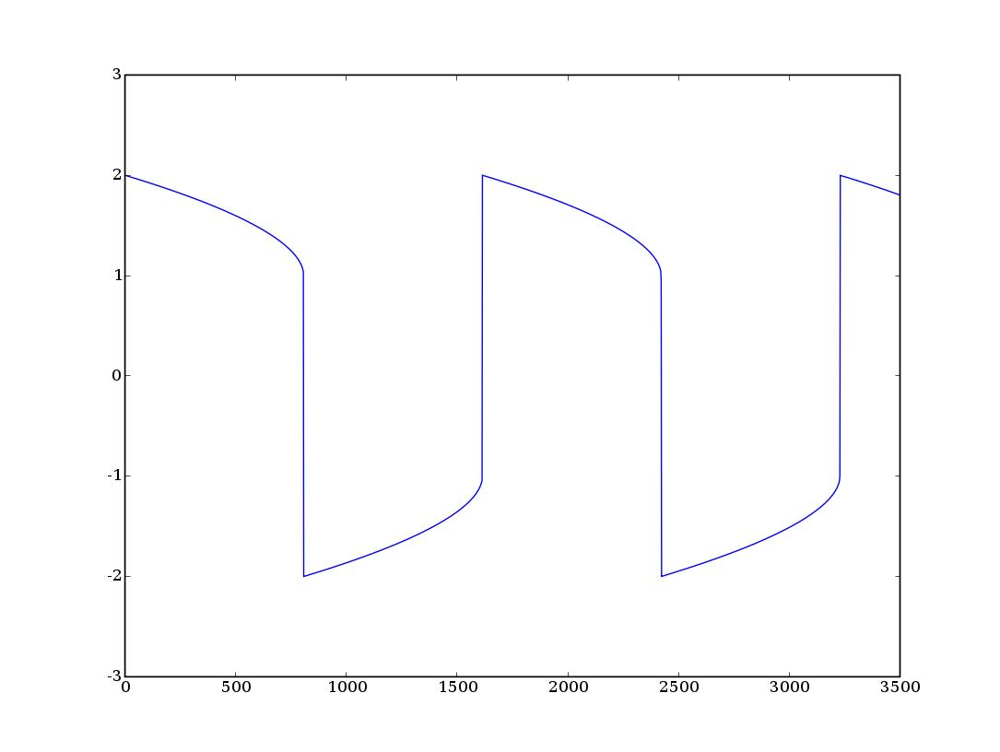

.. raw:: html

  

=======================================
Introducción informal a Matlab y Octave
=======================================

Segunda sesión
^^^^^^^^^^^^^^

Cálculo simbólico
=================

Tanto Matlab como Octave pueden operar con variables simbólicas con el
atributo *sym* pero no son intérpretes especializados

Algunos programas más adecuados para el cálculo simbólico son Maple,
Mupad o Máxima.

Polinomios
==========

En Matlab un vector cualquiera es a la vez un polinomio, [1 1 0] es
también |poli1|

.. |poli1|  raw:: html

  `x^2+x`

:poly: Obtiene el polinomio característico de una matriz

:roots: Obtiene las raíces de un polinomio

:polyval: Devuelve el valor de un polinomio en un punto dado

:polyder: Deriva un polinomio

Ejercicio 5
===========

Demostrar que el valor del polinomio característico de la matriz *L*
en el punto 0 es igual a cero.

Integración numérica
====================

:quad: Integración de una función unidimensional. (3 argumentos de entrada)

:quadl: Algoritmo mejorado, idéntico uso al anterior

:dblquad: Integración de una función de dos variables en dos
 dimensiones (¿Cuántos argumentos de entrada?)

:trapz: Aplica la regla del trapecio a una serie de puntos.  Mucha
 menor precisión ya que siempre podemos interpolar la nube con
 splines, lo que nos da mucha más precisión

Ejercicio 6
===========

Hacer la integral

.. raw:: html

  `I=\int_{-10}^{10}\int_{-10}^{10}e^{-(x^2+y^2)}dx\ dy`

que tiene como solución una aproximación a |pi|

.. |pi| raw:: html

  `\pi`

.. note:: 
  
  Utilizar una función anónima y hallar el resultado en una sóla línea
  de código.

Representación gráfica
======================

* Repesentar datos gráficamente en Matlab es muy sencillo e intuitivo

* Las funciones son pocas porque no hay demasiadas necesidades

* Matlab incluye un visualizador que no veremos

* No hay que dejarse encandilar por las posibilidades en
  represtentación gráfica:

  * Ley no escrita: *Si mejor un número que una curva, mejor una curva
    que una superfície y si tienes que representar una superfície
    posiblemente estés haciendo algo mal*.

* Sólo veremos curvas en el plano.  El resto tiene mucho menos
  misterio y utilidad.

Plot
====

La manera más sencilla de representar datos es mediante la función
*plot*

:Ejemplo: Representar una curva en el plano a partir de dos series de
 datos::

  >> x=linspace(0,500,100000);
  >> plot(x,exp(-x/100).*sin(x))

Para dibujar la función |exponsin| con |domx|

.. |exponsin| raw:: html

  `e^{-x/100}\sin x`

.. |domx| raw:: html

  `x \in [0,500]`

Plot II
=======

El resultado...

.. figure:: files/abanico.jpg

Plot III
========

Los atributos de las gráficas se introducen con la ventana activa

:Ejemplo: ::

  >> title('Una función cualquiera')
  >> xlabel('Tiempo')
  >> ylabel('Amplitud')

Plot IV
=======

El resultado...

Plot V
======

Dentro del mismo comando podemos poner varias curvas con distintos
estilos::

  >> x=linspace(-pi,pi,100);
  >> plot(x,sin(x),'m:',...
  x,cos(x),'k^',x,tan(x),'bx')
  >> axis([-pi,pi,-2,2])
  >> grid on
  >> legend('linea de puntos magenta',...
            'triangulos negros',...
            'cruces azules')

Plot VI
=======

.. figure:: files/trigplot.jpg

Plot VII
========

* La ventana gráfica se borra automáticamente cada vez que dibujamos
  algo

* Para cambiar el comportamiento anterior se usa la función *hold*

  * *hold on* mantiene todo lo dibujado en pantalla

  * *hold off* defuelve el comportamiento inicial

* Para borrar el contenido de la ventana se usa el comando *clf*

Plot VIII
=========

* Las ventanas gráficas se manipulan con la función *figure*

* Cada ventana gráfica tiene asociada un número entero

  * *figure* se llama con un número que corresponde al de la ventana

  * Si utilizamos un número que no corresponde a ninguna ventana
    existente crearemos una nueva con este número asociado

  * Si utilizamos un número existente activaremos la ventana
    correspondiente.

Subplot
=======

Es el comando que permite poner más de una figura en una misma
ventana.  Su uso es parecido al de combinar *figure* y *plot*.

:Ejemplo: ::

  >> x= linspace(-pi,pi,100);
  >> subplot(2,2,1)
  >> plot(x,sin(x))

De este modo generamos la primera de las subfiguras en el primero de
los cuatro sectores

Subplot II
==========

Subplot III
===========

Ahroa completamos los cuatro cuadrantes

:Ejemplo: ::

  >> subplot(2,2,2)
  >> plot(x,cos(x))
  >> subplot(2,2,3)
  >> plot(x,sinh(x))
  >> subplot(2,2,4)
  >> plot(x,cosh(x))

Subplot IV
==========

Otros comandos
==============

:semilogx: Dibuja una curva con el eje x en escala logarítmica

:semilogy: Dibuja una curva con el eje y en escala logarítmica

:loglog: Dibuna una curva en escala logarítmica.

Ejercicio 7
===========

Representar en una misma ventana y dos frames (uno superior y otro
inferior) la función:

.. raw:: html

  `sqrt{x} \sin(1/x)\ \ x\in[0.001,1]`

en escala normal y en escala semilogarítmica en el eje x

:Nota: La segunda gráfica tiene un problema de definición cerca de *x*
  =0.  ¿Cómo puede arreglarse?

Contour
=======

La mejor manera de representar superficies en tres dimensiones es
representar su proyección en el plano mediante isolíneas.  La ventaja
de esta representación es que permite conocer el valor de la función
con mucha más precisión.  Probad lo siguiente

:Ejemplo: ::

  >> contour(peaks)

Análisis de datos
=================

:interp1: Interpolación sobre una serie de puntos

:interp2: Interpolación sobre una nube bidimensional de puntos

:polyfit: Coeficientes del polinomio de grado *n* que resuleve el
 problema de mínimos cuadrados

:fft: Realiza la transformada rápida de Fourier

interp1
=======

::

  >> x=[1 2 3 4 5 6 7 8];
  >> y=[1 4 2 5 7 4 2 7];
  >> interp1(x,y,7.234,'spline')
  ans = 2.3437
  >> test=@(x,y,z) interp1(x,y,z,'spline');
  >> test(x,y,7.234)
  ans = 2.3437

polyfit
=======

::
  
  >> x=[1 2 3 4 5 6 7 8];
  >> y=[2 4 3 5 6 5 7 9];
  >> coeff=polyfit(x,y,3);
  >> plot(x,y,'k+',1:0.1:8,...
  polyval(coeff,1:0.1:8),'b-')

polyfitII
=========

.. figure:: files/polyfit.jpg

Estadística descriptiva
=======================

:mean: Calcula la media aritmética

:std: Calcula la desviación típica

:median: Calcula la mediana

:sort: Ordena los elementos de menor a mayor

:center: Elimina la media de una muestra

EDOs
====

* Es probablemente una de las aplicaciones más importantes del cálculo
  numérico

* Los problemas más comunes son los problemas de Cauchy (evolución
  temporal)

* En el caso de ecuaciones no lineales la solución numérica es
  esencial.  Puede ser que la solución analítica no se pueda hallar

* Lo más importante es saber si nuestro problema es stiff

EDOs II
=======

* Se dice que un problema es *stiff* cuando el paso temporal de
  integración viene determinado por la estabilidad del esquema, no por
  la precisión

* Suelen relacionarse con funciones que introducen fuertes gradientes
  o condiciones de contorno restrictivas

* Suelen asociarse a problemas no lineales

* Requieren esquemas de integración temporal implícitos

EDOs III
========

:ode45: Es un Runge-Kutta de paso variable y 4º orden.  La primera
 opción

:ode113: Esquema Adams multipaso

:ode23s: Esquema para problemas *stiff*

* Hay más funciones pero con estas tres basta

* Las funciones terminadas con *s* son para problemas *stiff*

EDOs IV
=======

Un caso típico es la ecuación de Van der Pol

.. raw:: html

  `x''+x+\mu(x'^2-1)x'=0`

Dependiendo del valor del coeficiente |mu| el problema es stiff o no.

.. |mu| raw:: html

  `\mu`

EDOs V
======
Para resolver el problema no *stiff* utilizamos un esquema
Runge-Kutta, *ode45*::

  >> [tout,xout]=ode45(@vdp1,[0 20],[2 0])
  >> plot(tout,xout(:,1))

EDOs VI
=======

EDOs VII
========

* Si ahora intentamos resolver el problema para |mu| =1000 con la misma
  función nos encontramos con la desagradable sorpresa de que no
  termina nunca.

* Esto es porque el problema es *stiff*. Para resolverlo cambiamos el
  método de integración a uno implícito::

  >> [tout,xout]=ode23s(@vdp1000,[0 3500],[2 0]);
  >> plot(tout,xout(:,1))

EDOs VIII
=========

Ejercicio 8
===========

Resolver el siguiente problema no stiff

.. raw:: html

  `((\dot x=a(y-x)),(\dot y = x(b-z)-y),(\dot z=xy-cz))`

Con *a* =10, *b* =28 y *c* =8/3, |tiempo| y |inicio| y representar la
solución en tres dimensiones como una curva paramétrica con *plot3*

.. |tiempo| raw:: html

  `t \in [0,50]`

.. |inicio| raw:: html

  `(x_0,y_0,z_0)=(1,1,1)`

El resultado...
===============

.. figure:: files/lorentz.jpg

Y para acabar...
================

* Estas transparencias no hubieran sido posibles sin reStructuredText
  y LaTeX

* Las figuras no las he hecho con Matlab sino con Python y Matplotlib

* **Usad Octave**

guillemborrell@gmail.com
