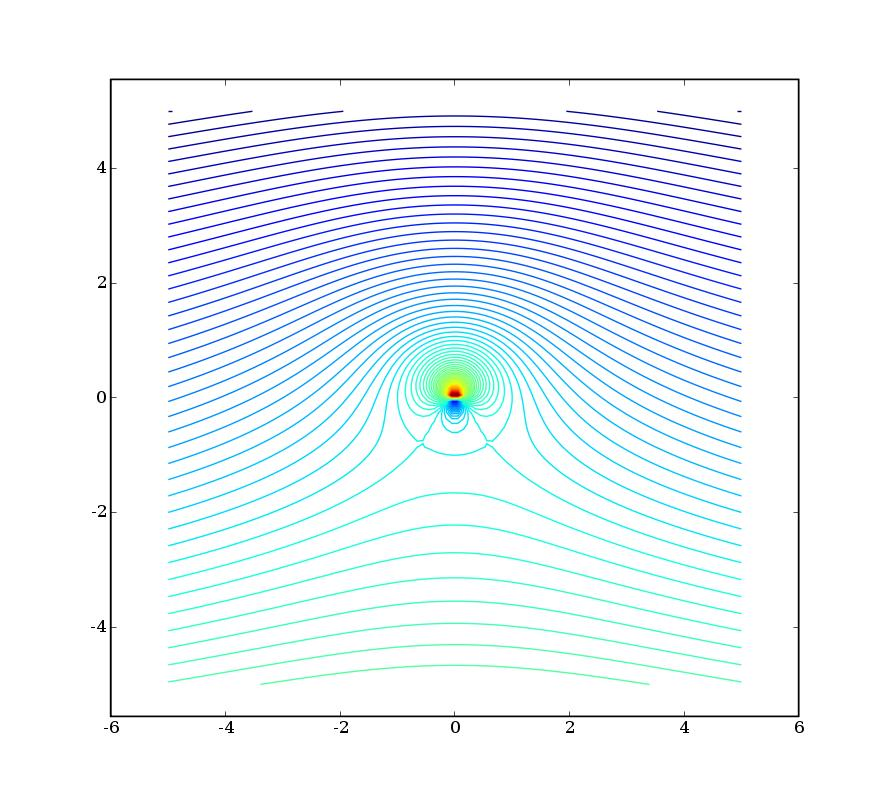

.. raw:: latex

  \author{Guillem Borrell i Nogueras}

==================================================
Octave: Una alternativa real a Matlab a coste cero
==================================================

.. raw:: latex

  \begin{abstract}

Octave es un proyecto de software libre maduro y consolidado. Es una
herramienta de gran utilidad en el campo del cálculo numérico en todas
sus vertientes.  Aunque no fue uno de sus objetivos iniciales, en su
madurez ha ido convergiendo hacia una de las estrellas del Software en
ingeniería, Matlab. Octave se ha convertido en una alternativa en dos
casos: cuando la adquisición de Matlab no es viable por cualquier
motivo y cuando la pericia de un buen programador en C++ puede
extender su funcionalidad.

.. raw:: latex
 
  \end{abstract}

¿Qué es Matlab?
===============

Matlab es un lenguaje de programación interpretado e interactivo, esto
significa que a diferencia de C o Fortran no se generan ejecutables
sino que un programa llamado interprete recibe órdenes y las ejecuta.
Estas órdenes se comunican al intérprete mediante un lenguaje de
programación que recibe el mismo nombre que el programa, Matlab.
Entonces utilizar Matlab es equivalente a programar en Matlab.

Matlab cuenta con una biblioteca de cálculo numérico y de ingeniería
tan extensa como útil y el intérprete es extensible mediante distintos
lenguajes compilados como C y Fortran.

Matlab tiene la gran virtud convertir en triviales tareas fáciles como
las operaciones elementales::

  >> 2+2
  ans = 4

O de convertir en fáciles tareas que no lo son en absoluto como por
ejemplo esta integral de una función de Bessel

.. raw:: latex

  \[ \int_0 ^{4.5} J_{2.5}\ dx \]

::

  >> quad(@(x) besselj(2.5,x)0,4.5)
  ans = 1.1178

Además, en Matlab es tremendamente fácil representar gráficamente
tanto curvas como superfícies.

Sin embargo Matlab no es ni orientado a objetos [#]_ ni modular ni
completamente interactivo.  Aquí no terminan los inconvenientes, al
ser un producto comercial sujeto a las estrategias de marketing de
MathWorks el lenguaje no es estable y debido a problemas de
compatibilidad hacia atrás hereda ciertas inconsistencias.  Antes de
adquirirlo debe meditarse si realmente vale lo que cuesta y la
respuesta a esta pregunta no es inmediata.

Como lenguaje de programación tiene competidores, algunos muy serios.
Se destacan Mathematica, Scilab, IDL, R, Octave y una nueva estrella
emergente, Python gracias a los proyectos Numpy y Scipy.

Un poco de historia
===================

Matlab es un producto de MathWorks_ .  Fue diseñado a finales de los
70 por Cleve Moler como una herramienta para evitar a sus estudiantes
tener que aprender Fortran.  Apareció como producto comercial en el
año 1984 y desde entonces ha ido gandando adeptos, sobretodo en el
campo del control lineal y no lineal y en la ingeniería en general.
La versión mas actual al escribir estas líneas es la R2007a

El orígen de Octave es bastante parecido, nació en la Universidad de
Wisconsin en Madison a finales de los ochenta como una herramienta
para completar las prácticas de ingeniería química.  La primera
versión alpha apareció en el año 1992 y la 1.0 en Febrero de 1994.
Pronto se popularizó dentro del mundo GNU/Linux y hace una década ya
se incluía en la distribución RedHat como paquete oficial.  El
desarrollador principal del proyecto es John W. Eaton.

Octave
======

Antes de decir una sola palabra sobre Octave es necesario dejar claro
lo siguiente: Octave no nació como un reemplazo de Matlab, ha ido
convergiendo por pura necesidad.  En palabras de John Eaton: -Hay
diferencias entre Matlab y Octave y algunas seguirán así.  No existen
porque Octave esté roto sino porque creemos que Matlab lo está.-

Pero la tesis es si Octave es una alternativa real a Matlab... ¿Lo
sigue siendo a pesar de sus diferencias?  Octave es compatible con
Matlab en un 99% pero es obvio que no es un remplazo perfecto.
Siempre existirán problemas de incompatibilidad debido a que el
lenguaje no está estandarizado de ningun modo. ¿Tiene Octave alguna
ventaja esencial que pueda paliar estas diferencias?  Sí.  **Octave es
software libre**.

Parte del proyecto GNU y publicado bajo la licencia GPL versión 2 o
posterior Octave se basa **al igual que Matlab** en bibliotecas de
código abierto o libres como Atlas, UMFPack o FFTW.  Al basarse en
gran parte en las mismas tecnologías el rendimiento en muchos casos es
parecido.

¿Por qué sustituir Matlab?
==========================

¿Hay alguna necesidad de buscar un sustituto libre a Matlab? ¿Es esta
necesidad real o sólo puede explicarse por motivos filosóficos?
Algunos proyectos de software libre argumentan que la libertad de uso
es un motivo suficiente como para no utilizar cualquier tipo de
software propietario.  Este motivo no es suficiente para una empresa
que requiere un producto garantizado y con soporte.  Este sector, el
que aporta dinero al mundo del desarrollo de software, debe tener
motivos reales para escoger un producto y descartar otro. Deben ser
razones de peso si se trata de abandonar algo tan útil y necesario
como Matlab.

Matlab es un producto comercial
-------------------------------

Matlab no es sólo un programa, es también un lenguaje de
programación.  Sin embargo MathWorks no piensa igual.  No existe
ningún estándar ni especificación más que el propio funcionamiento del
intérprete y la documentación.  Normalmente los lenguajes de
programación van con una especificación por delante para que los
desarrolladores tengan toda la información necesaria para poder
programar lo mejor posible.  Para MathWorks Matlab es primero una
aplicación y el lenguaje queda siempre en un segundo plano.

Matlab es caro, muy caro
------------------------

¿Cuánto cuesta Matlab? Lo suficiente como para que muchas empresas
tengan que descartarlo.  Este problema no se limita a pequeñas
empresas o consultorías donde el coste de una única licencia puede
significar una porción relevante de su presupuesto, también afecta a
grandes multinacionales.

Teras es una pequeña consultoría de nuevo cuño.  Uno de sus campos de
trabajo es el sector aeroespacial.  Como cualquier empresa del sector
se interesó por Matlab para aumentar su productividad en el campo del
análisis y tuvo que descartarlo por el coste tan desorbitado que
alcanzaba una única licencia, equivalente a la mitad del sueldo anual
de un consultor junior.

Rolls Royce, multinacional que ocupa el segundo puesto mundial como
fabricante de motores para aviación se encuentra en el otro extremo
del sector aeroespacial.  Para una empresa tan grande el volúmen más
importante de comunicación son datos.  Es imprescindible que todos los
ingenieros que trabajan en una misma empresa sean capaces de
utilizarlos lo que implica que la adquisición del número de licencias
de Matlab necesarias sea inviable.  Los servidores de licencias son
una solución parcial ya que en los picos de trabajo, cuando se
necesitan todas las licencias, es probable que un ingeniero clave no
pueda trabajar.  Matlab se ha descartado y los datos se analizan
mediante hojas de cálculo con la consiguiente pérdida de
productividad.

Matlab en las universidades
---------------------------

La Universidad Politécnica de Madrid dispone de un número no
despreciable de licencias para el uso académico.  Las actualiza
periódicamente para que tanto sus alumnos como el personal docente e
investigador dispongan de la última versión del software.  Es común
que haya un centenar de alumnos que utiliza Matlab simultáneamente.
En algunas escuelas las prácticas de la asignatura de cálculo numérico
se realizan en Matlab.  Esto genera una pregunta esencial.

Un alumno de segundo o tercer curso sólo utiliza un nimio porcentaje
de la herramienta. ¿Es necesario entonces utilizar algo tan costoso
para introducirlo al mundo de la programación teniendo en cuenta que
no lo aprovecha? Un intento de justificación es argumentar que hay que
enseñar lo que se utiliza en la industria pero ya se ha visto que su
implantación no está exenta de dificultades.

¿Es razonable hacerlo al coste equivalente de dos ordenadores? ¿No
sería más razonable comprar estos ordenadores e instalar un programa
casi idéntico como Octave?  Probablemente los responsables de IT de
muchas universidades nunca se hayan planteado estas preguntas.

Matlab Vs. Octave
=================

A pesar de los posibles inconvenientes Matlab es un gran programa.  Su
interfaz gráfica está bien pensada, está disponible en los tres
sistemas operativos mayoritarios.  Sus posibilidades para la
representación gráfica de datos con casi ilimitadas, el compilador de
Matlab es de una potencia bárbara y su optimización JIT [#]_ es efectiva en
bastantes casos.

Sin embargo su parser deja bastante que desear; incluso no acepta
estructuras sintácticas que serían consistentes en el lenguaje.  Al no
ser un proyecto de software libre no hay un modo de ampliarlo ni
definir nuevos tipos.  La interfaz gráfica, escrita en Java, no es tan
estable como podría desearse al igual que el intérprete capaz de
romperse en casos relativamente sencillos.  Todo esto a parte del
inconveniente del precio.

Octave soluciona algunos de los inconvenientes técnicos de Matlab.  No
tiene interfaz gráfica, algo que puede ser visto como una ventaja y
como un inconveniente; su parser es más listo y acepta estructuras más
complejas.  Aunque el intérprete tiene problemas de estabilidad como
el de Matlab se solucionan más rápidamente puesto que el tiempo de
publicación de nuevas versiones es más corto.  Es además muy fácil de
extender en C++ y permite un acceso directo a su maquinaria interna y
a sus librerías para utilizarlas en cualquier programa en C++.  Es una
herramienta más potente para un buen programador.

Conclusiones
============

Una de las tentaciones comunes de los usuarios habituales de Matlab es
que, como es capaz de realizar un amplio abanico de tareas, utilizarlo
para absolutamente todo: crear interfaces gráficas, realizar programas
relativametne grandes, analizar series de datos de mucha
complejidad... Parece razonable pensar que el concepto de una
aplicación para todo uso es erróneo. Entonces...

* Si no se utiliza Matlab hasta para hacer tortillas de patatas

* Si no se necesita un determinado toolkit y es imposible
  desarrollarlo en un tiempo razonable

* So no está y adisponible y...

* Si utilizarlo no es una obligación

Si no se cumple ninguna de las condiciones anteriores entonces **no
hay ningún motivo razonable para no probar Octave**

Ejemplos
========

A continuación se explorarán algunas de las características de Octave
dentro de su campo de aplicación, el cálculo numérico.  No solo se
tratará Octave como un intérprete del lenguaje Matlab sino que
mostrarán algunos ejemplos de cómo utilizar lenguajes compilados para
mejorar el comportamiento de un programa de simulación.

Flujo alrededor de un cilindro
------------------------------

Sabiendo un poco de aerodinámica y dominando el campo de la variable
compleja se demuestra que el potencial complejo de velocidades
alrededor de un cilindro es

.. raw:: latex

  \[ t + \frac{1}{t} + \frac{i\Gamma}{2 \pi}\log\ t \]

Para representar las líneas de corriente basta con este pequeña
porción de código::

  gamma=input('¿Circulación?');
  f=@(x,y) (x+i*y) + 1./(x+i*y) +...
  	 (i*gamma)/(2*pi)*log(x+i*y);
  [XX,YY]=meshgrid(linspace(-5,5,100),...
		linspace(-5,5,100));
  contour (XX,YY,-imag(f(XX,YY)),29)

El resultado es la siguiente figura

Para los que no conozcan Matlab ni Octave es notorio que se ha llegado
a un resultado no trivial con un esfuerzo mínimo mediante el uso de
muchas funciones que deben conocerse previamente.

Este código tiene la particularidad de ejecutarse con el mismo
resultado tanto en Matlab como en Octave.  En la mayoría de los casos
se presentarán incompatibilidades que requerirán cambios mínimos.

Aumentar la velocidad
---------------------

Una característica común entre los lenguajes interpretados es la
posibilidad de escribir funciones en lenguajes compilados que luego el
intérprete es capaz de entender.  Es un proceso más o menos laborioso
pero tiene la ventaja de aumentar significativamente la velocidad de
ejecución.  El objetivo es conseguir con el mínimo esfuerzo acercar la
velocidad del intérprete a la que se conseguiría con un código
enteramente escrito en C o C++.

Esta es la función de atractor de Lorentz

.. raw:: latex

  \[
  \begin{array}{ccl}
  \dot x & = & a(y-x)\\
  \dot y & = & x(b-z)-y \\
  \dot z & = & xy-cz
  \end{array}\]

Para integrarla es necesario escribirla como archivo .m::

  function xdot=lorentz(t,x)
    a=10;b=28;c=8/3;
    xdot(1,1)=a*(x(2)-x(1));
    xdot(2,1)=x(1)*(b-x(3))-x(2);
    xdot(3,1)=x(1)*x(2)-c*x(3);
  end

Ahora exactamente la misma función en C++ preparada para acoplarla
a Octave::

  #include <octave/oct.h>
  DEFUN_DLD (eqlorentz,args, ,
    "Ecuacion de Lorentz en C++")
    {
      ColumnVector xdot (3);
      ColumnVector x (args(0).vector_value());
      int a=10;
      int b=28;
      double c=8./3;
      xdot(0) = a*(x(1)-x(0));
      xdot(1) = x(0)*(b-x(2))-x(1);
      xdot(2) = x(0)*x(1)-c*x(2);

      return octave_value (xdot);
    }

El esfuerzo de reescribir la función a C++ no es tan exagerado.  Sólo
requiere conocer el lenguaje y unas pocas funciones para crear y
devolver valores al intérprete. Mientras la primera es comprensible
por el intérprete directamente, la segunda requiere ser compilada y
enlazada con las bibliotecas de Octave::

  $> mkoctfile eqlorentz.cpp

Este proceso genera un archivo llamado ``eqlorentz.oct`` que para
Octave es equivalente a un .m con la diferencia de ser un archivo
binario.  Si se integra la primera versión de la función::

  >> x0=[1;1;1];
  >> t=linspace(0,50,5000);
  >> tic;x=lsode(@lorentz,x0,t);toc

Se llega al resultado en un tiempo de 5.1 segundos [#]_ .Pero si se
utiliza la nueva versión en C++::

  >> x0=[1;1;1];
  >> t=linspace(0,50,5000);
  >> tic;x=lsode(@eqlorentz,x0,t);toc

¡El tiempo de ejecución se reduce a 0.36 segundos! Es un orden de
magnitud en el rendimiento y se acerca muchísimo a los timpos
obtenidos con código enteramente escrito en C++ con un coste muchísimo
menor.

Queda demostrado entonces, por lo menos para un caso sencillo, que el
mito que los lenguajes interpretados son irremisiblemente lentos no
es tan cierto como parecía.

Tests
-----

Una cerencia de Matlab como lenguaje de programación es la posibilidad
de realizar test de contingencia para saber si un programa funciona
como debe.  Octave sí propone la infraestructura necesaria para ello.

Algunas escuelas de metodología de programación como Extreme
Programming sugieren que los test son lo primero que debe diseñarse,
incluso antes que el algoritmo que resuelve el problema. Su utilidad
radica más en el futuro mantenimiento o ampliación del código que en
la escritura inicial.  Es un seguro que los cambios realizados a una
rutina no alterarán su diseño.

El siguiente es un mal ejemplo porque el código realiza una operación
tremendamente simple pero sirve para esbozar su funcionamiento.  Para
probar la función matpow, que eleva a una potencia entera una matriz
cuadrada::

  function b = matpow(a, n)
    b = eye(size(a));
    for i = 1:n
      b = b * a;
    endfor

Se realizan los siguientes test; no cuesta mucho deducir para qué
sirve la función ``assert``::

  %!shared a
  %!test
  %!  a = [ 2.0, -3.0;
  %!       -1.0,  1.0];
  %!
  %!assert(matpow(a,0), diag([1,1]));
  %!assert(matpow(a,1), a);
  %!assert(matpow(a,2), a^2);
  %!assert(matpow(a,3), a^3);
  %!assert(matpow(a,4), a^4);
  %!assert(matpow(a,22), a^22);
  %!assert(matpow(a,23), a^23);

Estas líneas se escribirían al final de la función.  Para realizar los
test basta volver al intérprete y ejecutar::

  octave:1> test matpow
  PASSES 8 out of 8 tests

Octave desde C++
----------------

El último de los ejemplos ilustra cómo la biblioteca de cálculo
matricial de Octave; estable, potente, completa y funcional, puede
utilizarse desde C++ de un modo relativamente sencillo.  Para resolver
el siguiente sistema de ecuaciones

.. raw:: latex

  \[
  \left( \begin{array}{cc}
  2 & -6 \\
  5 & 3
  \end{array}\right)x=
  \left( \begin{array}{c}
  1 \\
  0 \end{array} \right)
  \]

El código que resuelve el problema se entiende perfectamente sólo con
nociones básicas de C++::

  #include <iostream>
  #include <oct.h>

  int main(void) 
  {
    Matrix a = Matrix (2,2);
    ColumnVector b = ColumnVector(2);
    a(0,0)=2.;a(1,0)=5.;
    a(0,1)=-6.;a(1,1)=3.;
    b(0)=1.;b(1)=0.;

    std::cout  << a.solve(b);
    return 0; 
  }

Octave prevé este uso de sus librerías.  Para facilitar la compilación
y el enlazado para crear un ejecutable el programa ``mkoctfile`` sirve
de gran ayuda.  Basta con ir a una consola UNIX::

  $> mkoctfile --link-stand-alone embedded.cpp

Y ejecutar el programa::

  $> ./a.out
  0.0833333
  -0.138889

Conclusiones finales
====================

Octave no puede considerarse un sustituto perfecto de Matlab pero sí
una alternativa en algunos casos.  Es un proyecto maduro y completo
que permite a un programador hábil realizar algoritmos numéricos de
gran complejidad reduciendo al máximo los timempos de
desarrollo. También son útiles conocimientos de C++ para ampliar el
intérprete y conseguir tiempos de ejecución cercanos a los de los
lenguajes compilados.

.. [#] Matlab cuenta con algo parecido a la orientación a objetos que
       no puede considerarse como tal.  Pueden agruparse funciones
       para que se comporten de un modo parecido a como lo haría un
       objeto pero es capaz de definir una clase.

.. [#] JIT son las siglas de Just In Time, una tecnología de
       optimización automática de código que hace que su principal
       escollo a nivel de rendimiento, los bucles, no lo sean tanto.

.. [#] El ordenador utilizado ha sido un Athlon 2000 XP, algo obsoleto
       teniendo en cuenta que sólo soporta 3dnow y SSE.

.. _MathWorks: http://www.mathworks.com
