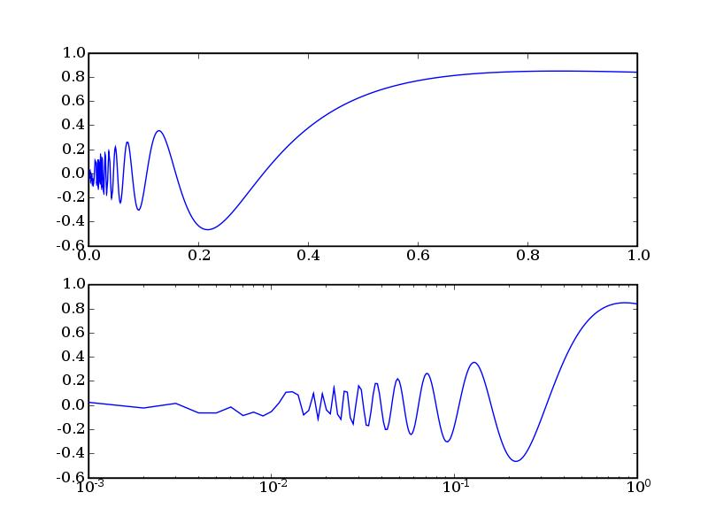
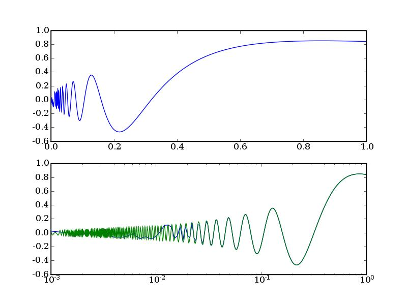

====================================
Solución de los problemas planteados
====================================

Segunda sesión
==============

5. Calculamos el polinomio característico con

::

  >> poly(L)
  p =

   Columns 1 through 7:

   1.0000e+00   1.4000e+01   7.7000e+01   2.1000e+02   ...

   Column 8:

   5.7695e-15

  >> polyval(p,0)
  ans =  5.7695e-15

6. Octave no dispone de la función *dblquad*.  Es mejor la función
   *quad2dg* que utiliza una cuadratura de Gauss.  Para resolverlo en
   Matlab.

::

    >> dblquad(@(x,y) exp(-(x.^2+y.^2)),-10,10,-10,10)

Para resolverlo en Octave

::

    >> quad2dg(@(x,y) exp(-(x.^2+y.^2)),-10,10,-10,10)

7. Para representar gráficamente la solución

::

  >> x=linspace(0.001,1,1000);
  >> subplot(2,1,1)
  >> plot(x,sqrt(x).*sin(1./x))
  >> subplot(2,1,2)
  >> semilogx(x,sqrt(x).*sin(1./x))

Para arreglar la precisión del segundo gráfico *manteniendo la
cantidad de puntos* podemos utilizar la función *logspace* que
equispaciaría los puntos sobre el eje *x* en una gráfica
semilogarítmica.

::

  >> x=logspace(-3,0,1000);
  >> semilogx(x,sqrt(x).*sin(1./x))

8. Integrar el *Atractor de Lorentz* y representarlo como una curva
   paramétrica en tres dimensiones.

La ecuación es

.. raw:: latex

  \[\begin{array}{l}
  \dot x = a(y-x)\\
  \dot y = x(b-z)-y\\
  \dot z = xy-cz
  \end{array} \]

Y hay que integrarla con *a* = 10, *b* = 28 y *c* = 8/3 con |tiempo| y
|cinicial|. Para ello utilizaremos un esquema Runge-Kutta de paso
variable con la función *ode45*

.. |tiempo| raw:: latex

  $t \in [0,50]$

.. |cinicial| raw:: latex

  $x_0=(1,1,1)$

El primer paso es ecribir la función tal como la función ode45 nos
pide que hagamos.  Nos dice que necesita una función de la forma
[y]=f(t,x) aunque nuestra ecuación en particular no dependa del
tiempo.  Esta forma concuerda con la forma general de los problemas de
Cauchy: dy/dt= F(t,y)

Sólo nos queda 'copiar' la función a Matlab::

  function xdot=lorentz(t,x)
  a=10;b=28;c=8/3;
  xdot(1,1)=a*(x(2)-x(1));
  xdot(2,1)=x(1)*(b-x(3))-x(2);
  xdot(3,1)=x(1)*x(2)-c*x(3);

Es imprescindible definir las constantes a, b y c antes de escribir
cualquier sentencia ejecutable que las contenga.  Hay que recordar
siempre que las únicas variables que podemos dejar sin definir en una
función son las presentes en la cabecera, ya sea como argumentos de
entrada o de salida.  El vector xdot se ha introducido de esta manera
(como vector columna) porque la función ode45 nos pide un vector
columna como argumento de salida de nuestra función.  Una alternativa
es escribir el vector xdot como fila (es más corto) y luego
trasponerlo con::

  xdot=xdot';

Ahora debemos integrar la ecuación diferencial.  La función ode45
necesita tres argumentos de entrada, un function handle a la función
que queremos integrar, un intervalo de tiempos (un vector de dos
elementos) y un punto inicial donde empezar la integración.  Los
argumentos de entrada son un vector de tiempos con el avance en el
intervalo y un vector que contiene la solución.  Llamaremos al vector
de tiempos t y al vector solución del la curva x.::

  [t,x]=ode45(@lorentz,[0,50],[1,1,1]);

Podemos ignorar a partir de aquí el vector de tiempos, para
representar la curva en tres dimensiones sólo nos interesa la
solución.  El vector x tiene tres columnas, cada una representando x,
y y z (una curva en tres dimensiones).  Para representarla debemos
poner en cada uno de los tres argumentos de plot3 uno de estos
vectores.  Para ello::

  plot3(x(:,1),x(:,2),x(:,3));

La solución debe ser parecida a la siguiente curva

.. figure:: files/lorentz.jpg
  :scale: 50
