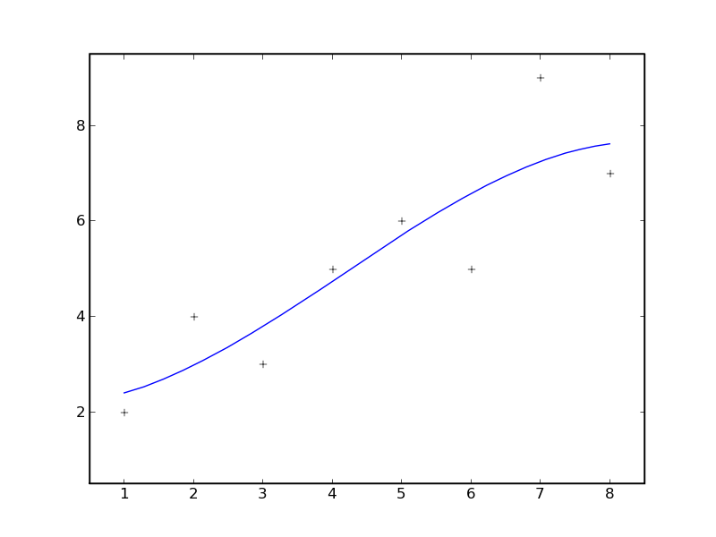

.. raw:: html

  

================================================
Introducción a Octave para la Docencia en la UCA
================================================

Segunda sesión
^^^^^^^^^^^^^^

Guillem Borrell i Nogueras

10-13 de Junio de 2008

Temario
=======

* Lenguaje Matlab.

* Sistemas de ecuaciones lineales.

* Integración numérica.

* Polinomios, interpolación y regresión.

* Representación gráfica.

* EDOs.

* Análisis de señales.

* ¿Sugerencias?

Terminamos con...
=================

Un ejercicio inútil pero muy instructivo
----------------------------------------

Operadores
==========

:Operadores matriciales: +,-,*,/,^

:Operadores escalares: .*,./,.^

:Operadores lógicos: &,|,!

:Operadores de comparación: <,>,==,>=,<=,!=

:Operadores de conjuntos: &&,||

Diferencias entre & y &&
========================

::

  octave:2> a=[1,2;0,1];
  octave:3> b=[1,0;0,1];
  octave:4> a&b
  ans =
  
     1   0
     0   1
  
  octave:5> a&&b
  ans = 0
  
La segunda opción se utiliza para las sentencias condicionales.

Operadores II 
=============

Operadores matriciales y escalares pueden confundirse fácilmente::

  >> a=rand(3,3);
  >> a=rand(3,3);b=rand(3,3);
  >> a*b
  ans =
      1.0297    0.9105    0.3293
      0.9663    0.8267    0.4211
      0.5355    0.4318    0.3279
  >> a.*b
  ans =
      0.1824    0.3253    0.0563
      0.5500    0.6003    0.1897
      0.0458    0.0017    0.1822

Operadores III
==============

O dar resultados extraños::

  >> a=[1,2,3;4,5,6;7,8,9];
  >> a.^pi
  ans =
      1.0000    8.8250   31.5443
     77.8802  156.9925  278.3776
    451.8079  687.2913  995.0416
  >> a^pi
  ans =
   1.0e+03 *
   0.6943 - 0.0004i   0.8540 - 0.0001i   1.0136 + 0.0002i
   1.5743 - 0.0000i   1.9344 - 0.0000i   2.2946 + 0.0000i
   2.4543 + 0.0003i   3.0149 + 0.0001i   3.5756 - 0.0002i

Ejercicio de vectorización
==========================

con |A|, |b| y |c|

.. |A| raw:: html

  `A=((1,2,3),(4,5,6),(7,8,9))`

.. |b| raw:: html

  `b=((1),(2),(3))`

.. |c| raw:: html

  `c=(1,2,3)`

calcular 

* |op1|

.. |op1| raw:: html

  `A \cdot b`

* |op2|

.. |op2| raw:: html

  `\sum_i A_{ij}c_i`

* |op3|

.. |op3| raw:: html

  `b \cdot c`

luego aplicar al resultado de cada operación la función |func|

.. |func| raw:: html

  `x^2 \sin x`

Control de flujo
================

* No hay diferencias con otros lenguajes de programación
  *interpretados*

* En estos lenguajes un bucle es en realidad un *iterador*

Condicionales
=============

Este es un ejemplo del uso de la sentencia *if*::

  if saludo
    disp('hola')
  else
    disp('no te saludo')
  end

¿Cuál es la salida si saludo=1?

Bucles
======

Ejemplo del uso de la sentencia *for*::

  function primetest(n)
  sprintf('Números primos de 1 a %i\n',n)
  for i=1:n
    if isprime(n)
      disp(i)
    end
  end

¿Cuál es la salida de esta subrutina si n=9?

Bucles iteradores
=================

Recordad que secuencia == vector

::

  octave:6> for i=[1,3,2,4,3,4,5]
  > disp(i)
  > end
   1
   3
   2
   4
   3
   4
   5
  

Otras sentencias
================

:case: Control de casos cerrados

:while: Bucle controlado por condición lógica

:try: Sentencia de control para probar errores

:break: Clave para el control de bucles

:continue: Idem

:return: Devuelve el control al programa principal

Funciones anónimas. *Importante*
================================

Una de las posibilidades de los *Function Handles* es definir
funciones sin necesidad de un archivo adicional. Por ejemplo::

  >> testaf = @(x,y) exp(-(x.^2+y.^2))
  >> testfh(1,i)
  ans = 1

Problemas
=========

* Inconsistencias en el BC

* Inconsistencias en creación llamada, [],()

* Orientación a objetos. *Python*.

* Soporte para más tipos numéricos.

* ¿Vector fila o columna?

* La notación del punto (escalar-matricial)

Problemas arreglados por Octave
===============================

Inlining

::
 
  octave:1> a=rand(3,3)(1,2)
  a =  0.14272

Permite expresiones mucho más compactas.

Problemas arreglados por Octave
===============================

Declaración de funciones

::

  octave:2> function y=foo(x)
  > y=3*x
  > end
  octave:3> foo(4)
  y =  12
  ans =  12

  
¿A qué espera Mathworks para arreglar esto?

Problemas arreglados por Octave
===============================

El precio
---------

  
Conclusiones
============

* El lenguaje Matlab es muy limitado

* Es sencillo y su sintaxis es clara

* Sus estructuras son muy matemáticas

* Está basado en funciones y aún no conocemos ninguna

* Sin una biblioteca de funciones Matlab no es ni siquiera un buen
  lenguaje de programación

Álgebra
=======

Con estas funciones se puede crear casi cualquier matriz

:eye: Matriz de ceros con unos en la diagonal

:linspace: Vector de elementos equiespaciados

:logspace: Vector de elementos espaciados exponencialmente

:meshgrid: Matrices equiespaciadas de dos dimensiones

:ones: Matriz de unos

:zeros: Matriz de ceros

:rand: Matriz de números pseudoaleatorios.

Manipulación de matrices
========================

:reshape: Cambia la forma de la matriz conservando el número de
 elementos

:transpose: Traspuesta. Equivale a .'

:ctranspose: Matriz conjugada. Equivale a '

:rot90: Gira la matriz 90 grados en sentido antihorario.

Resolución de SEL
=================

Para resolver sistemas de eucuaciones lineales contamos con un
operador universal::

  >> A=[1,0;2,1];y=[2;4];
  >> x=A\y
  x =

    2
    0

¿En qué se diferencia de la división?

Ejercicio
=========

Resolver la ecuación de Laplace en 1d con CC Dirichlet:

.. raw:: html

  `\frac{d^2 v}{dx^2}=0`

Mediante diferencias finitas.

.. raw:: html

  `\frac{v_{i-1}-2v_{i}+v_{i+1}}{\Delta x^2}=0`

Ejercicio
=========

.. raw:: html

  `\Delta x = 1`,

.. raw:: html

  `v_0 = 0`, 

.. raw:: html

  `v_n = 1`

Ejercicio
=========

Crear una *función* que genere esta matriz con *n* arbitrario

.. raw:: html

  `A=((1,0,0,0,0,0,0),(1,-2,1,0,0,0,0),(0,1,-2,1,0,0,0),(0,0,1,-2,1,0,0),(0,0,0,1,-2,1,0),(0,0,0,0,1,-2,1),(0,0,0,0,0,0,1))`

Usando también la función *diag*

Ejercicio
=========

Crear una función que cree el término independiente con *n*
arbitrario:

.. raw:: html

  `b=(0,0,0,0,0,0,1)^T`

y resolver para *n* = 7

Cálculo simbólico
=================

Tanto Matlab como Octave pueden operar con variables simbólicas con el
atributo *sym* pero no son intérpretes especializados

Algunos programas más adecuados para el cálculo simbólico son Maple,
Mupad o Maxima.

Integración numérica
====================

:quad: Integración de una función unidimensional. (3 argumentos de entrada)

:quadl: Algoritmo mejorado, idéntico uso al anterior

:quad2dg: Integración de una función de dos variables en dos
 dimensiones (¿Cuántos argumentos de entrada?). En Matlab se llama
 dblquad

:trapz: Aplica la regla del trapecio a una serie de puntos.  Mucha
 menor precisión ya que siempre podemos interpolar la nube con
 splines, lo que nos da mucha más precisión

Ejercicio
=========

Hacer la integral

.. raw:: html

  `I=\int_{-10}^{10}\int_{-10}^{10}e^{-(x^2+y^2)}dx\ dy`

que tiene como solución una aproximación a |pi|

.. |pi| raw:: html

  `\pi`

.. note:: 
  
  Utilizar una función anónima y hallar el resultado en una sóla línea
  de código. ¿Podemos integrarla en todo |R2|?

.. |R2| raw:: html

  `R^2`

Polinomios
==========

En Matlab un vector cualquiera es a la vez un polinomio, [1 1 0] es
también |poli1|

.. |poli1|  raw:: html

  `x^2+x`

:poly: Obtiene el polinomio característico de una matriz

:roots: Obtiene las raíces de un polinomio

:polyval: Devuelve el valor de un polinomio en un punto dado

:polyder: Deriva un polinomio

Ejercicio
=========

* Obtener los autovalores de la matriz A con *n* = 7 a partir de su
  polinomio característico.

* Evaluar el polinomio característico en 0

Análisis de datos
=================

:interp1: Interpolación sobre una serie de puntos

:interp2: Interpolación sobre una nube bidimensional de puntos

:polyfit: Coeficientes del polinomio de grado *n* que resuleve el
 problema de mínimos cuadrados

:fft: Realiza la transformada rápida de Fourier

interp1
=======

::

  >> x=[1 2 3 4 5 6 7 8];
  >> y=[1 4 2 5 7 4 2 7];
  >> interp1(x,y,7.234,'spline')
  ans = 2.3437
  >> test=@(x,y,z) interp1(x,y,z,'spline');
  >> test(x,y,7.234)
  ans = 2.3437

polyfit
=======

::
  
  >> x=[1 2 3 4 5 6 7 8];
  >> y=[2 4 3 5 6 5 7 9];
  >> coeff=polyfit(x,y,3);
  >> plot(x,y,'k+',1:0.1:8,...
  polyval(coeff,1:0.1:8),'b-')

polyfitII
=========

Estadística descriptiva
=======================

:mean: Calcula la media aritmética

:std: Calcula la desviación típica

:median: Calcula la mediana

:sort: Ordena los elementos de menor a mayor

:center: Elimina la media de una muestra

Representación gráfica
======================

* Repesentar datos gráficamente en Matlab es muy sencillo e intuitivo

* Las funciones son pocas porque no hay demasiadas necesidades

* Matlab incluye un visualizador que no veremos

* No hay que dejarse encandilar por las posibilidades en
  represtentación gráfica:

  * Ley no escrita: *Si mejor un número que una curva, mejor una curva
    que una superfície y si tienes que representar una superfície
    posiblemente estés haciendo algo mal*.

* Sólo veremos curvas en el plano.  El resto tiene mucho menos
  misterio y utilidad.

Plot
====

La manera más sencilla de representar datos es mediante la función
*plot*

:Ejemplo: Representar una curva en el plano a partir de dos series de
 datos::

  >> x=linspace(0,500,100000);
  >> plot(x,exp(-x/100).*sin(x))

Para dibujar la función |exponsin| con |domx|

.. |exponsin| raw:: html

  `e^{-x/100}\sin x`

.. |domx| raw:: html

  `x \in [0,500]`

Plot II
=======

El resultado...

.. figure:: files/abanico.jpg
  :width: 600px

Plot III
========

Los atributos de las gráficas se introducen con la ventana activa

:Ejemplo: ::

  >> title('Una función cualquiera')
  >> xlabel('Tiempo')
  >> ylabel('Amplitud')

Plot IV
=======

El resultado...

.. figure:: files/abanico2.jpg
  :width: 600px

Plot V
======

Dentro del mismo comando podemos poner varias curvas con distintos
estilos::

  >> x=linspace(-pi,pi,100);
  >> plot(x,sin(x),'m:',...
  x,cos(x),'k^',x,tan(x),'bx')
  >> axis([-pi,pi,-2,2])
  >> grid on
  >> legend('linea de puntos magenta',...
            'triangulos negros',...
            'cruces azules')

Plot VI
=======

.. figure:: files/trigplot.jpg
  :width: 600px

Plot VII
========

* La ventana gráfica se borra automáticamente cada vez que dibujamos
  algo

* Para cambiar el comportamiento anterior se usa la función *hold*

  * *hold on* mantiene todo lo dibujado en pantalla

  * *hold off* defuelve el comportamiento inicial

* Para borrar el contenido de la ventana se usa el comando *clf*

Plot VIII
=========

* Las ventanas gráficas se manipulan con la función *figure*

* Cada ventana gráfica tiene asociada un número entero

  * *figure* se llama con un número que corresponde al de la ventana

  * Si utilizamos un número que no corresponde a ninguna ventana
    existente crearemos una nueva con este número asociado

  * Si utilizamos un número existente activaremos la ventana
    correspondiente.

Subplot
=======

Es el comando que permite poner más de una figura en una misma
ventana.  Su uso es parecido al de combinar *figure* y *plot*.

:Ejemplo: ::

  >> x= linspace(-pi,pi,100);
  >> subplot(2,2,1)
  >> plot(x,sin(x))

De este modo generamos la primera de las subfiguras en el primero de
los cuatro sectores

Subplot II
==========

.. figure:: files/trig1.jpg
  :width: 600px

Subplot III
===========

Ahroa completamos los cuatro cuadrantes

:Ejemplo: ::

  >> subplot(2,2,2)
  >> plot(x,cos(x))
  >> subplot(2,2,3)
  >> plot(x,sinh(x))
  >> subplot(2,2,4)
  >> plot(x,cosh(x))

Subplot IV
==========

.. figure:: files/trig4.jpg
  :width: 600px

Otros comandos
==============

:semilogx: Dibuja una curva con el eje x en escala logarítmica

:semilogy: Dibuja una curva con el eje y en escala logarítmica

:loglog: Dibuna una curva en escala logarítmica.

Ejercicio
=========

Representar en una misma ventana y dos frames (uno superior y otro
inferior) la función:

.. raw:: html

  `sqrt{x} \sin(1/x)\ \ x\in[0.001,1]`

en escala normal y en escala semilogarítmica en el eje x

:Nota: La segunda gráfica tiene un problema de definición cerca de *x*
  =0.  ¿Cómo puede arreglarse?

Contour
=======

La mejor manera de representar superficies en tres dimensiones es
representar su proyección en el plano mediante isolíneas.  La ventaja
de esta representación es que permite conocer el valor de la función
con mucha más precisión.  Probad lo siguiente

:Ejemplo: ::

  >> contour(peaks)

EDOs
====

* Es probablemente una de las aplicaciones más importantes del cálculo
  numérico

* Los problemas más comunes son los problemas de Cauchy (evolución
  temporal)

* En el caso de ecuaciones no lineales la solución numérica es
  esencial.  Puede ser que la solución analítica no se pueda hallar

* Lo más importante es saber si nuestro problema es stiff

EDOs II
=======

* Se dice que un problema es *stiff* cuando el paso temporal de
  integración viene determinado por la estabilidad del esquema, no por
  la precisión

* Suelen relacionarse con funciones que introducen fuertes gradientes
  o condiciones de contorno restrictivas

* Suelen asociarse a problemas no lineales

* Requieren esquemas de integración temporal implícitos

EDOs III
========

:ode45: Es un Runge-Kutta de paso variable y 4º orden.  La primera
 opción

:ode113: Esquema Adams multipaso

:ode23s: Esquema para problemas *stiff*

* Hay más funciones pero con estas tres basta

* Las funciones terminadas con *s* son para problemas *stiff*

EDOs IV
=======

Un caso típico es la ecuación de Van der Pol

.. raw:: html

  `x''+x+\mu(x'^2-1)x'=0`

Dependiendo del valor del coeficiente |mu| el problema es stiff o no.

.. |mu| raw:: html

  `\mu`

EDOs V
======
Para resolver el problema no *stiff* utilizamos un esquema
Runge-Kutta, *ode45*::

  >> [tout,xout]=ode45(@vdp1,[0 20],[2 0])
  >> plot(tout,xout(:,1))

EDOs VI
=======

.. figure:: files/vdp1.jpg
  :width: 600px

EDOs VII
========

* Si ahora intentamos resolver el problema para |mu| =1000 con la misma
  función nos encontramos con la desagradable sorpresa de que no
  termina nunca.

* Esto es porque el problema es *stiff*. Para resolverlo cambiamos el
  método de integración a uno implícito::

  >> [tout,xout]=ode23s(@vdp1000,[0 3500],[2 0]);
  >> plot(tout,xout(:,1))

EDOs VIII
=========

.. figure:: files/vdp1000.jpg
  :width: 600px

Ejercicio 8
===========

Resolver el siguiente problema no stiff

.. raw:: html

  `((\dot x=a(y-x)),(\dot y = x(b-z)-y),(\dot z=xy-cz))`

Con *a* =10, *b* =28 y *c* =8/3, |tiempo| y |inicio| y representar la
solución en tres dimensiones como una curva paramétrica con *plot3*

.. |tiempo| raw:: html

  `t \in [0,50]`

.. |inicio| raw:: html

  `(x_0,y_0,z_0)=(1,1,1)`

El resultado...
===============

.. figure:: files/lorentz.jpg
  :width: 600px
