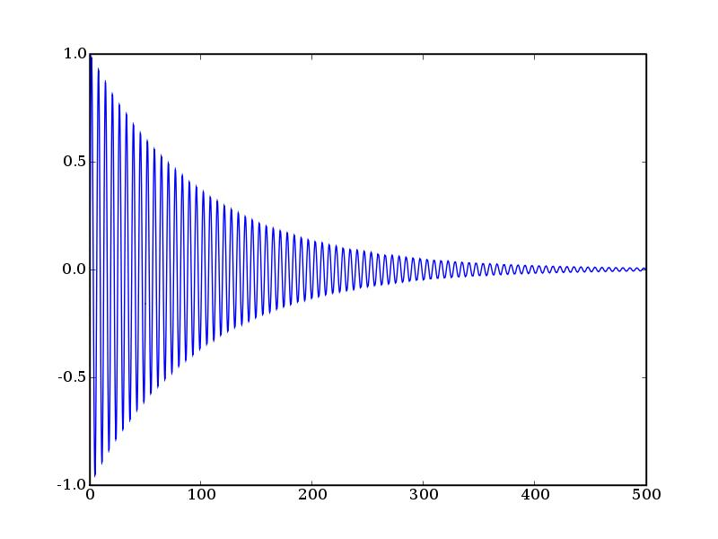
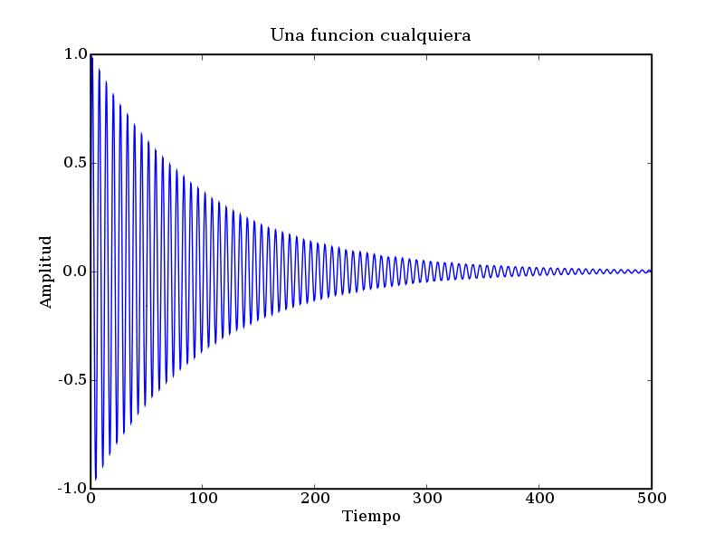
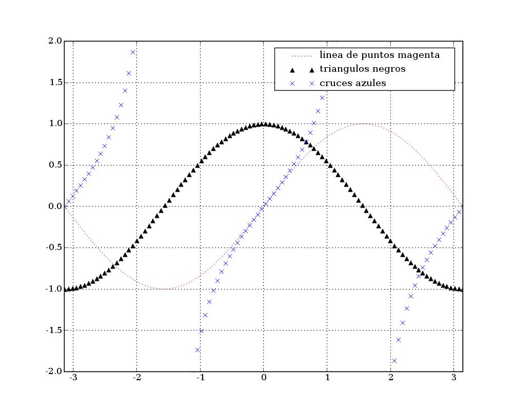
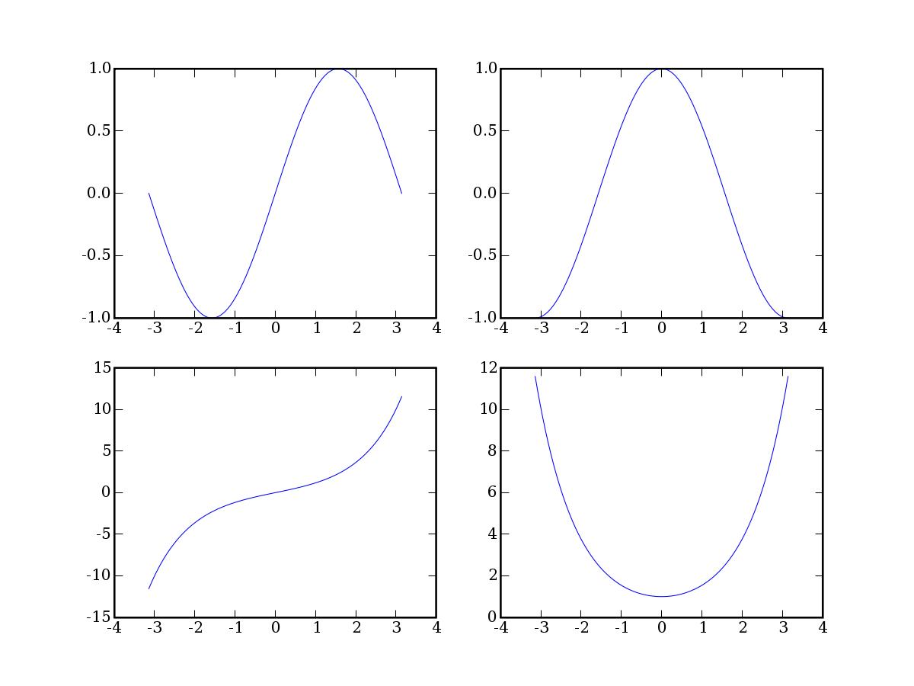
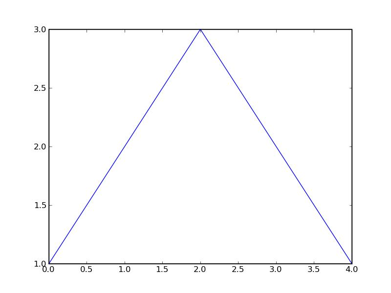
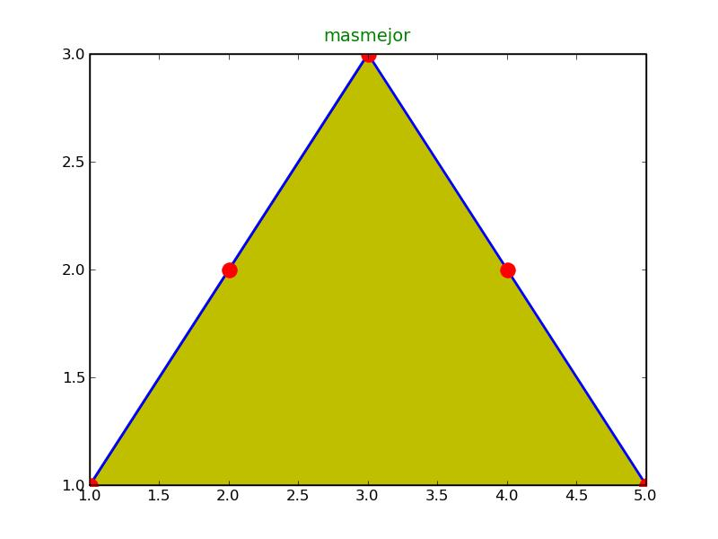
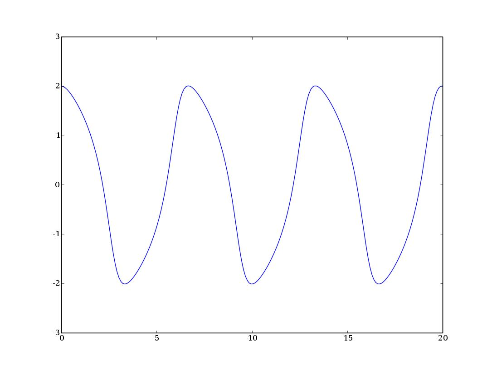
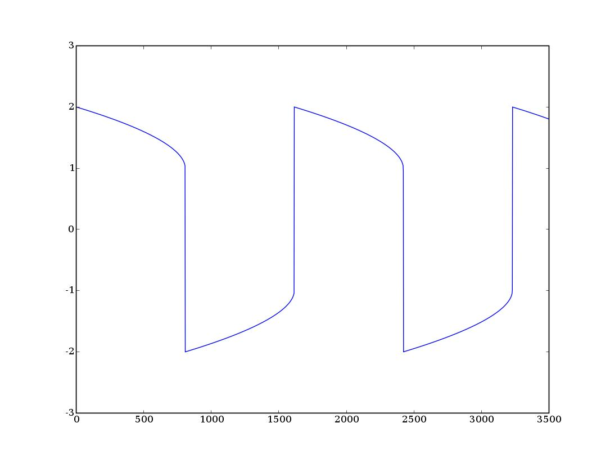

.. raw:: html

  

================================================
Introducción a Octave para la Docencia en la UCA
================================================

Tercera sesión
^^^^^^^^^^^^^^

Guillem Borrell i Nogueras

10-13 de Junio de 2008

Temario
=======

* Lenguaje Matlab.

* Sistemas de ecuaciones lineales.

* Integración numérica.

* Polinomios, interpolación y regresión.

* Representación gráfica.

* EDOs.

* Análisis de señales.

* ¿Sugerencias?

Representación gráfica
======================

* Repesentar datos gráficamente en Matlab es muy sencillo e intuitivo

* Las funciones son pocas porque no hay demasiadas necesidades

* Matlab incluye un visualizador que no veremos

* No hay que dejarse encandilar por las posibilidades en
  represtentación gráfica:

  * Ley no escrita: *Si mejor un número que una curva, mejor una curva
    que una superfície y si tienes que representar una superfície
    posiblemente estés haciendo algo mal*.

* Sólo veremos curvas en el plano.  El resto tiene mucho menos
  misterio y utilidad.

Plot
====

La manera más sencilla de representar datos es mediante la función
*plot*

:Ejemplo: Representar una curva en el plano a partir de dos series de
 datos::

  >> x=linspace(0,500,100000);
  >> plot(x,exp(-x/100).*sin(x))

Para dibujar la función |exponsin| con |domx|

.. |exponsin| raw:: html

  `e^{-x/100}\sin x`

.. |domx| raw:: html

  `x \in [0,500]`

Plot II
=======

El resultado...

Plot III
========

Los atributos de las gráficas se introducen con la ventana activa

:Ejemplo: ::

  >> title('Una función cualquiera')
  >> xlabel('Tiempo')
  >> ylabel('Amplitud')

Plot IV
=======

El resultado...

Plot V
======

Dentro del mismo comando podemos poner varias curvas con distintos
estilos::

  >> x=linspace(-pi,pi,100);
  >> plot(x,sin(x),'m:',...
  x,cos(x),'k^',x,tan(x),'bx')
  >> axis([-pi,pi,-2,2])
  >> grid on
  >> legend('linea de puntos magenta',...
            'triangulos negros',...
            'cruces azules')

Plot VI
=======

Plot VII
========

* La ventana gráfica se borra automáticamente cada vez que dibujamos
  algo

* Para cambiar el comportamiento anterior se usa la función *hold*

  * *hold on* mantiene todo lo dibujado en pantalla

  * *hold off* defuelve el comportamiento inicial

* Para borrar el contenido de la ventana se usa el comando *clf*

Plot VIII
=========

* Las ventanas gráficas se manipulan con la función *figure*

* Cada ventana gráfica tiene asociada un número entero

  * *figure* se llama con un número que corresponde al de la ventana

  * Si utilizamos un número que no corresponde a ninguna ventana
    existente crearemos una nueva con este número asociado

  * Si utilizamos un número existente activaremos la ventana
    correspondiente.

Subplot
=======

Es el comando que permite poner más de una figura en una misma
ventana.  Su uso es parecido al de combinar *figure* y *plot*.

:Ejemplo: ::

  >> x= linspace(-pi,pi,100);
  >> subplot(2,2,1)
  >> plot(x,sin(x))

De este modo generamos la primera de las subfiguras en el primero de
los cuatro sectores

Subplot II
==========

.. figure:: files/trig1.jpg
  :width: 600px

Subplot III
===========

Ahroa completamos los cuatro cuadrantes

:Ejemplo: ::

  >> subplot(2,2,2)
  >> plot(x,cos(x))
  >> subplot(2,2,3)
  >> plot(x,sinh(x))
  >> subplot(2,2,4)
  >> plot(x,cosh(x))

Subplot IV
==========

Otros comandos
==============

:semilogx: Dibuja una curva con el eje x en escala logarítmica

:semilogy: Dibuja una curva con el eje y en escala logarítmica

:loglog: Dibuna una curva en escala logarítmica.

Ejercicio
=========

Representar en una misma ventana y dos frames (uno superior y otro
inferior) la función:

.. raw:: html

  `sqrt{x} \sin(1/x)\ \ x\in[0.001,1]`

en escala normal y en escala semilogarítmica en el eje x

:Nota: La segunda gráfica tiene un problema de definición cerca de *x*
  =0.  ¿Cómo puede arreglarse?

Contour
=======

La mejor manera de representar superficies en tres dimensiones es
representar su proyección en el plano mediante isolíneas.  La ventaja
de esta representación es que permite conocer el valor de la función
con mucha más precisión.  Probad lo siguiente

:Ejemplo: ::

  >> contour(peaks)

Plot handles
============

* La función *plot* puede devolver una variable con todas las
  propiedades del dibujo.

* Un *Plot handle* es en realidad una estructura.

* La función *get* sirve para obtener el valor de una propiedad.

* La función *set* serve para cambiarlo.

Plot handles
============

::

  octave:1> p=plot([1,2,3,2,1])
  p = -2.3944
  octave:2> get(p)
  ans =
  {
    tag =
    type = line
    parent = -1.8402
    children = 
    __modified__ =  1
    xdata =
  
       1
       2
       3
       4
       5
  (...)

Plot handles
============

Plot handles
============

::

  >> set(p,'linewidth',2)
  >> set(p,'marker','o')
  >> set(p,'markersize',12)
  >> set(p,'markeredgecolor','r')
  >> t=title('masmejor')
  >> set(t,'fontsize',14)  
  >> set(t,'color','g')
  >> h=fill([1,2,3,4,5],[1,2,3,2,1],'y')

Plot handles
============

EDOs
====

* Es probablemente una de las aplicaciones más importantes del cálculo
  numérico

* Los problemas más comunes son los problemas de Cauchy (evolución
  temporal)

* En el caso de ecuaciones no lineales la solución numérica es
  esencial.  Puede ser que la solución analítica no se pueda hallar

* Lo más importante es saber si nuestro problema es stiff

EDOs II
=======

* Se dice que un problema es *stiff* cuando el paso temporal de
  integración viene determinado por la estabilidad del esquema, no por
  la precisión

* Suelen relacionarse con funciones que introducen fuertes gradientes
  o condiciones de contorno restrictivas

* Suelen asociarse a problemas no lineales

* Requieren esquemas de integración temporal implícitos

EDOs III
========

:lsode: Interfaz de Octave a *odepack*

:ode45: Es un Runge-Kutta de paso variable y 4º orden.  La primera
 opción

:ode113: Esquema Adams multipaso

:ode23s: Esquema para problemas *stiff*

* Hay más funciones pero con estas tres basta

* Las funciones terminadas con *s* son para problemas *stiff*

EDOs IV
=======

Un caso típico es la ecuación de Van der Pol

.. raw:: html

  `x''+x+\mu(x'^2-1)x'=0`

Dependiendo del valor del coeficiente |mu| el problema es stiff o no.

.. |mu| raw:: html

  `\mu`

EDOs V
======
Para resolver el problema no *stiff* utilizamos un esquema
Runge-Kutta, *ode45*::

  >> lsode_options('integration method','non-stiff');
  >> y=lsode(@vdp1,[0 2],linspace(0,20,1000);
  >> plot(linspace(0,20,1000),xout(:,1));

EDOs VI
=======

EDOs VII
========

* Si ahora intentamos resolver el problema para |mu| =1000 con la misma
  función nos encontramos con la desagradable sorpresa de que no
  termina nunca.

* Esto es porque el problema es *stiff*. Para resolverlo cambiamos el
  método de integración a uno implícito::

  >> lsode_options('integration method','stiff');
  >> y=lsode(@vdp1,[0 2],linspace(0,3000,100000);
  >> plot(linspace(0,3000,100000),xout(:,1));

EDOs VIII
=========

Ejercicio 8
===========

Resolver el siguiente problema no stiff

.. raw:: html

  `((\dot x=a(y-x)),(\dot y = x(b-z)-y),(\dot z=xy-cz))`

Con *a* =10, *b* =28 y *c* =8/3, |tiempo| y |inicio| y representar la
solución en tres dimensiones como una curva paramétrica con *plot3*

.. |tiempo| raw:: html

  `t \in [0,50]`

.. |inicio| raw:: html

  `(x_0,y_0,z_0)=(1,1,1)`

El resultado...
===============

.. figure:: files/lorentz.jpg
  :width: 600px

Ejercicio
=========

A partir de dos series de datos
